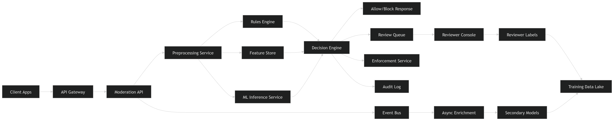

# Large-Scale Content Moderation System

**Use case:** toxic vs non-toxic moderation for posts, comments, captions, ads, stories, reels metadata, and related text surfaces at Facebook/Instagram scale.

---

## 1. Problem Statement

Build a production-grade moderation system that classifies user-generated content into:

* **Allowed**
* **Blocked**
* **Needs review**
* **Age/region restricted**
* **Downrank / distribution-limited**

Primary task here is **toxicity detection**, but the system should be extensible to:

* hate / harassment
* bullying
* sexual content text cues
* self-harm cues
* violent threats
* spam / scam / policy evasion
* ad policy violations

This is not just an ML problem. It is a **real-time decisioning + ranking + human review + feedback loop** system.

---

# 2. Goals

## Main objective

Protect users from harmful content while minimizing wrongful takedowns and maintaining low moderation latency.

## Secondary objectives

* support billions of moderation decisions per day
* work across multiple content surfaces
* support multilingual content
* provide explainability and auditability
* allow policy teams to update rules quickly
* use humans only for uncertain / high-risk cases
* continuously retrain on drift and new abuse patterns

---

# 3. Functional Requirements

## 3.1 Core moderation flows

1. Accept moderation requests for:

   * comments
   * post captions
   * ads text
   * story text / overlays / OCR text output
   * reel titles / captions / hashtags
   * profile bio / usernames if needed

2. Return one of:

   * allow
   * block
   * soft-block with user warning
   * queue for human review
   * downrank / reduce reach
   * geo / age restriction

3. Produce:

   * toxicity score
   * subtype scores
   * confidence / uncertainty
   * policy labels
   * rationale fields for internal debugging

4. Support both:

   * **online moderation** for pre-publish or immediate post-publish checks
   * **batch moderation** for backfill, rescans, and model upgrades

5. Support policy versioning:

   * a decision must record which model version, feature version, and policy version produced it

6. Support appeals:

   * if a user appeals, surface the moderation record and route to review

7. Human-in-the-loop:

   * send uncertain or high-impact cases to reviewers
   * reviewer verdicts become labels for training

8. Support repeated rescoring:

   * old content can be rescanned with new models or new policy

9. Rate limiting / abuse mitigation:

   * if an account repeatedly posts toxic content, elevate enforcement

10. Integrate with downstream systems:

* feed ranking/downranking systems
* notify trust & safety enforcement
* notify advertiser quality systems for ads

---

# 4. Non-Functional Requirements

## 4.1 Scale

Assume Facebook/Instagram scale:

* billions of new text artifacts per day
* massive burstiness during events, elections, sports, crises

## 4.2 Latency

Different surfaces need different SLAs:

* **comment publish check:** p95 < 100 ms preferred
* **post caption / ad review:** p95 < 300 ms
* **async rescoring:** throughput optimized, latency less important
* **human review queueing:** seconds acceptable

## 4.3 Availability

* online moderation pipeline: **99.99%** target for allow/block decision service
* graceful degradation required

## 4.4 Consistency

* moderation decision should be durable and auditable
* exact model + policy version must be reconstructable
* eventual consistency acceptable for downstream analytics

## 4.5 Reliability

* no silent drops
* every request should end in durable state:

  * decided
  * queued
  * failed + retried
  * degraded fallback

## 4.6 Security / Compliance

* PII minimization
* encryption in transit / at rest
* RBAC for reviewer tools
* immutable audit logs for high-impact actions

## 4.7 Extensibility

* easy to add new classifiers
* easy to add new languages
* easy to add rules on top of ML

---

# 5. High-Level Product Decisions

Before design, clarify:

## 5.1 Pre-publish vs post-publish

Two valid strategies:

### Strict pre-publish moderation

Good for:

* ads
* comments in risky contexts
* known bad actors

Pros:

* harmful content never goes live

Cons:

* tight latency budget
* false positives hurt UX

### Publish-then-moderate

Good for:

* lower-risk content at scale

Pros:

* better UX
* more model time possible

Cons:

* harmful content may be briefly visible

### Practical design

Use **hybrid**:

* comments / ads / high-risk users: pre-publish
* long-tail posts/stories: publish with async post-check + rapid takedown

---

# 6. End-to-End System Overview



---

# 7. Back-of-the-Envelope Estimation

We need rough scale assumptions.

## 7.1 Assumptions

Suppose across FB + IG text surfaces:

* comments/day = 8B
* captions/titles/descriptions/day = 1B
* ads/day for review/update = 100M
* bios/usernames/other text/day = 200M

Total moderation text items/day ≈ **9.3B/day**

Average:

* per second = 9.3B / 86400 ≈ **107K req/s**
* peak traffic maybe 5x average = **500K+ req/s**

This is realistic interview-scale thinking.

## 7.2 Payload size

Average text payload after metadata:

* raw text + IDs + locale + context = ~1 KB/request

At 100K req/s average:

* ingress = 100 MB/s
* peak 500 MB/s

## 7.3 Storage

If each moderation record stores:

* content_id
* user_id
* text hash
* scores
* decision
* model version
* policy version
* timestamps
* features summary

Say ~500 bytes compressed/event for long-term logs.

9.3B/day × 500 bytes ≈ **4.65 TB/day**
Annual raw ≈ **1.7 PB/year** before compaction/tiering.

## 7.4 Human review load

Suppose:

* 1% routed to human review
* 9.3B/day × 1% = **93M/day**

That is absurdly high. So this tells you something important:

**At this scale, review rate must be far below 1%.**

Target:

* 0.01% review rate
* 930K/day still huge but plausible with global reviewer ops + prioritization

Interview point:
**Human review is the scarce resource, so model calibration and policy thresholds matter more than raw model accuracy.**

---

# 8. Functional Architecture

## 8.1 Major components

### 1. Content Ingestion Service

Receives moderation requests from:

* comment service
* post service
* ads manager
* stories service

Adds:

* request ID
* content type
* actor ID
* locale
* surface metadata

### 2. Preprocessing / Normalization Service

Handles:

* lowercase / unicode normalization
* repeated characters compression
* slang normalization
* URL / mention / hashtag standardization
* emoji mapping
* profanity obfuscation decoding
* language detection
* script detection
* transliteration support if needed

### 3. Feature Store / Context Service

Provides:

* user prior violations count
* account age
* recipient sensitivity context
* conversation context
* thread context
* geo / language priors
* domain reputation for URLs
* account trust score

### 4. Rule Engine

Fast deterministic checks:

* exact banned phrases
* regex for threats / slurs / scam patterns
* repeated spam templates
* blocklisted advertiser phrases
* policy overrides by market

### 5. ML Inference Service

Runs:

* fast online toxicity model
* subtype classifiers
* uncertainty estimator
* optional ensemble for high-risk flows

### 6. Decision Engine

Combines:

* rules
* ML scores
* user/account context
* product policy thresholds

Outputs action:

* allow
* block
* review
* restrict
* downrank

### 7. Review Queue Service

Prioritizes items needing human review based on:

* confidence gap
* virality potential
* public figure / minor safety
* appeal status
* policy sensitivity

### 8. Enforcement Service

Executes:

* content takedown
* user warning
* strike counting
* ad rejection
* distribution suppression

### 9. Feedback / Label Logging

Stores:

* model outputs
* reviewer verdicts
* appeals outcomes
* policy audits

### 10. Training Pipeline

Consumes logs and labels to:

* retrain models
* recalibrate thresholds
* detect drift
* run shadow evaluation

---

# 9. Data Flow

## 9.1 Online path

1. user submits comment/post/ad text
2. ingestion service receives request
3. preprocessing normalizes text
4. quick feature/context lookup
5. rule engine executes
6. ML inference runs
7. decision engine applies thresholds
8. decision returned to caller
9. moderation event logged asynchronously

## 9.2 Async path

1. event published to Kafka/PubSub/Kinesis equivalent
2. secondary enrichment adds thread/account/network features
3. lower-priority or more expensive models run
4. risky content may be reclassified
5. actions updated
6. all artifacts written to data lake

## 9.3 Human review path

1. uncertain/high-risk item goes to review queue
2. reviewer sees content + policy guidance
3. reviewer labels outcome
4. verdict feeds enforcement + training labels

---

# 10. API Sketch

## 10.1 Moderate content

```json
POST /moderate
{
  "content_id": "c123",
  "user_id": "u456",
  "surface": "comment",
  "content_type": "text",
  "text": "you are trash",
  "locale": "en-US",
  "context": {
    "thread_id": "t1",
    "parent_text": "nice post",
    "target_user_id": "u999"
  }
}
```

Response:

```json
{
  "request_id": "r789",
  "decision": "ALLOW_WITH_WARNING",
  "policy_labels": ["toxicity", "harassment"],
  "scores": {
    "toxicity": 0.91,
    "harassment": 0.84
  },
  "confidence": 0.78,
  "policy_version": "policy_2026_03_01",
  "model_version": "tox_v17"
}
```

## 10.2 Re-score content

```json
POST /moderate/rescore
{
  "content_ids": ["c123", "c124"],
  "model_version": "tox_v18"
}
```

## 10.3 Reviewer verdict

```json
POST /review/verdict
{
  "review_id": "rev1",
  "decision": "BLOCK",
  "policy_labels": ["hate_speech"]
}
```

---

# 11. Data Model

## 11.1 Moderation request table

* request_id
* content_id
* content_type
* surface
* actor_id
* created_at
* locale
* raw_text_pointer
* normalized_text
* context_pointer

## 11.2 Moderation result table

* request_id
* model_version
* feature_version
* policy_version
* rule_hits
* scores_json
* uncertainty
* final_decision
* final_reason
* latency_ms
* decision_ts

## 11.3 Review task table

* review_id
* request_id
* priority
* queue
* assigned_to
* status
* reviewer_decision
* reviewer_notes
* resolved_at

## 11.4 Enforcement table

* action_id
* content_id
* actor_id
* action_type
* scope
* start_ts
* end_ts
* strike_count_after_action

## 11.5 Training label table

* label_id
* request_id
* label_source

  * reviewer
  * appeal
  * user report consensus
  * heuristic
* label
* quality_score
* created_at

---

# 12. ML System Design

## 12.1 Problem framing

This is rarely a pure binary classifier in production.

A better framing:

* multi-label classifier for policy categories
* calibrated risk score
* action policy layer on top

Why?
Because “toxic” is not enough.
You need:

* toxicity
* severe toxicity
* insult
* identity attack
* threat
* sexual harassment
* spam / scam overlap

Then action policy decides what to do.

---

## 12.2 Model stack

### Tier 0: Rules

Cheap and instant.
Use for:

* exact slurs
* repeated attack patterns
* advertiser violations
* emergency policy launches

### Tier 1: Lightweight online model

Low latency transformer/distilled model or fast encoder.
Use for:

* synchronous decisioning
* p95 latency sensitive paths

### Tier 2: Richer async model

Larger transformer / multilingual model / ensemble.
Use for:

* rescoring
* difficult cases
* shadow evaluation
* model teacher labeling

### Tier 3: Human review

Used when:

* uncertainty high
* high virality risk
* high policy impact
* protected categories involved

---

# 13. Feature Engineering

## 13.1 Text features

* tokenized text
* character n-grams
* subword embeddings
* profanity patterns
* repeated punctuation / capitalization
* emoji semantics
* obfuscation markers (`b!tch`, `1d10t`, etc.)
* URL/domain type
* hashtag semantics

## 13.2 Contextual features

* reply vs standalone
* thread toxicity history
* whether target is a minor/public figure
* prior interaction pattern between users
* user trust score
* account age
* recent violation streak
* virality estimate

## 13.3 Language features

* detected language
* code-switching
* script type
* locale-specific abuse lexicons

---

# 14. Data Preprocessing Pipeline

This part matters a lot in interviews.

## 14.1 Raw data sources

* reviewer labeled data
* appeals outcomes
* user reports with consensus
* prior moderation logs
* synthetic adversarial abuse examples
* public toxicity datasets only as bootstrap, not enough for production

## 14.2 Cleaning

* deduplicate near-identical samples
* remove corrupted / null text
* normalize encoding
* strip or separately store PII if not needed
* remove weak labels with poor agreement

## 14.3 Label quality control

* measure inter-annotator agreement
* gold set for reviewer QA
* separate policy ambiguity from annotation noise
* downweight low-confidence labels

## 14.4 Class imbalance handling

This is critical.
Toxic content is often rare relative to benign content.

Use:

* stratified sampling
* hard negative mining
* class weighting / focal loss
* threshold tuning per class
* active learning to acquire informative edge cases

## 14.5 Adversarial normalization

Examples:

* `i h@te y0u`
* `k y s`
* spaced slurs
* homograph attacks
* mixed scripts

Need:

* character normalization
* script folding where safe
* obfuscation detector
* robust tokenizer

## 14.6 Train/val/test split

Must prevent leakage by:

* user-level split
* conversation/thread-level split
* time-based split for drift realism

Do not randomly split only by row. That leaks patterns badly.

---

# 15. Metrics to Optimize

There is no single metric.

## 15.1 Offline ML metrics

### Precision

Among predicted toxic, how many are truly toxic?

Important when:

* wrongful takedowns are expensive

### Recall

Among truly toxic, how many did we catch?

Important when:

* user harm is expensive

### PR-AUC

Better than ROC-AUC for heavy class imbalance.

### F1

Balanced summary, but often not enough for policy systems.

### Calibration error

Very important.
If model says 0.9 risk, that score should mean something.

### Class-wise recall / precision

Needed for:

* threats
* hate speech
* harassment
* self-harm
  These behave differently.

---

## 15.2 Moderation product metrics

### False positive rate

Bad content policy UX if too high.

### False negative rate

Safety risk if too high.

### Review rate

Must stay manageable.

### Appeal overturn rate

If many appeals succeed, system is overblocking.

### Reviewer agreement

Measures policy clarity and label quality.

### Time to action

How long harmful content stays visible.

### Harm exposure

Views/impressions before takedown.
This is a top product metric.

### Prevalence

What fraction of viewed content is toxic?
This is often better than raw detection metrics.

### Latency

p50 / p95 / p99 for online moderation.

### Cost per moderated item

Important at huge scale.

---

## 15.3 Business / ecosystem metrics

* user retention impact
* creator false-block rate
* advertiser rejection precision
* abuse recidivism reduction
* safety perception surveys

---

# 16. Thresholding Strategy

Do not use one global threshold.

Use per-surface thresholds:

* comments: higher recall
* ads: higher precision
* stories: lower latency, maybe async correction
* trusted accounts vs new accounts: different enforcement policy

A common setup:

* score < T1 => allow
* T1 to T2 => allow but log / downrank / soft intervention
* T2 to T3 => human review
* > T3 => block automatically

For extreme threats or explicit banned phrases:

* hard rule-based block

---

# 17. Human Review System

## 17.1 Why needed

Model uncertainty is unavoidable. Policy nuance is huge.

## 17.2 Queue prioritization

Prioritize by:

* virality
* policy severity
* model uncertainty
* appeal status
* account reach
* geographic or current-event sensitivity

## 17.3 Reviewer UX

Reviewer console should show:

* content text
* context thread
* previous model scores
* applicable policy
* similar historical examples
* decision shortcuts
* escalation path

## 17.4 Reviewer quality controls

* gold tasks
* disagreement audits
* escalation for ambiguous cases
* reviewer consistency tracking

---

# 18. High-Level Design (HLD)

## 18.1 Core services

* API Gateway
* Content Moderation API
* Preprocessing Service
* Feature Store / Context Service
* Rules Service
* Model Inference Service
* Decision Engine
* Review Queue Service
* Enforcement Service
* Event Bus
* Logging / Audit Service
* Training & Evaluation Platform
* Monitoring / Alerting stack

## 18.2 Storage choices

### OLTP store

Use a distributed transactional DB for:

* moderation decisions
* review tasks
* enforcement records

Examples conceptually:

* sharded MySQL / Spanner / Cockroach / strong key-value store

### Feature store / cache

Use:

* Redis / online feature store

### Event/log pipeline

Use:

* Kafka / PubSub / Kinesis equivalent

### Data lake

Use:

* object storage + warehouse
  for:
* training data
* analytics
* backfills

### Search/index

For reviewer tools:

* Elasticsearch / OpenSearch style system

---

## 18.3 HLD diagram


---

# 19. Low-Level Design (LLD)

## 19.1 Request execution path

For each moderation request:

### Step 1

Generate request_id and fetch content metadata.

### Step 2

Normalize text:

* unicode normalization
* whitespace collapse
* obfuscation cleanup
* language detection

### Step 3

Fast rules:

* exact deny list
* regex matches
* emergency policy rules

### Step 4

Fetch online features:

* user trust score
* account age
* prior strikes
* thread context
* content surface type

### Step 5

Run model inference:

* lightweight toxicity model
* subtype model
* uncertainty estimator

### Step 6

Decision engine combines:

* rule priority
* calibrated scores
* thresholds by surface/policy
* trust-based overrides

### Step 7

Persist result and publish event

### Step 8

If needed, enqueue review or trigger enforcement

---

## 19.2 Decision engine pseudologic

```text
if hard_block_rule_hit:
    return BLOCK

if severe_threat_score > 0.99:
    return BLOCK

if confidence low and risk medium/high:
    return REVIEW

if toxicity high and user_trust low:
    return BLOCK or DOWNRANK

if toxicity medium:
    return ALLOW_WITH_WARNING or LIMIT_REACH

else:
    return ALLOW
```

---

## 19.3 Storage partitioning

Partition moderation records by:

* day
* content type
* shard on content_id or actor_id

Review queue partition by:

* priority
* language
* policy family

Feature store keys:

* user_id
* account_id
* thread_id
* domain_id

---

## 19.4 Model serving details

Need:

* low-latency online serving
* dynamic rollout
* model version pinning
* canary deployment
* shadow traffic support

Online service design:

* stateless inference pods
* autoscaled on CPU/GPU utilization + queue depth
* batch small requests internally for GPU efficiency if SLA allows

---

# 20. Real-Time vs Batch Moderation

## Real-time

Used for:

* comments
* ad submission
* risky users
* live interaction surfaces

Requirements:

* low latency
* lightweight model
* tight cache design

## Batch

Used for:

* retroactive rescoring
* model migrations
* newly banned phrases
* policy change rollouts
* quality audits

Requirements:

* very high throughput
* cheap compute
* large models allowed

Interview point:
**Production systems nearly always use both.**

---

# 21. Training Pipeline

## 21.1 Data sources

* reviewer decisions
* appeals
* user reports
* prior model disagreements
* high-impression content
* newly emerging abuse patterns

## 21.2 Candidate data generation

Sample from:

* false positives
* false negatives
* uncertain predictions
* policy edge cases
* multilingual slices

## 21.3 Retraining cadence

* daily or weekly light refresh for thresholds/calibration
* weekly or biweekly full retrain
* urgent policy hotfix via rules immediately

## 21.4 Evaluation before deployment

Must evaluate on:

* holdout set
* time-split set
* language slices
* surface slices
* high-risk policy slices
* reviewer-agreement benchmark
* live shadow traffic

---

# 22. Deployment Strategy

## 22.1 Serving architecture

Use Kubernetes or equivalent.

Separate deployments:

* moderation API
* preprocessing service
* rules service
* inference service
* decision engine
* reviewer backend
* async consumers

## 22.2 Model deployment

Use:

* model registry
* immutable model artifacts
* versioned configs
* canary rollout
* A/B testing
* shadow deployment first

## 22.3 Rollout plan

1. offline validation
2. shadow traffic
3. internal dogfood
4. 1% canary
5. 10%
6. 50%
7. full rollout

Rollback must be instant via:

* model version switch
* threshold rollback
* rule override

---

# 23. Monitoring and Observability

## 23.1 System metrics

* QPS
* p50/p95/p99 latency
* timeout rate
* queue depth
* retry rate
* inference throughput
* cache hit rate
* GPU/CPU utilization

## 23.2 ML metrics in production

* score distribution shift
* class prevalence drift
* language drift
* threshold crossing rates
* review rate
* appeal overturn rate
* reviewer disagreement
* model-vs-human disagreement

## 23.3 Business safety metrics

* toxic prevalence in impressions
* time-to-takedown
* harmful exposure before action
* creator false-positive complaints

---

# 24. Failure Modes and Mitigations

## 24.1 Inference service down

Fallback:

* rules-only mode
* conservative thresholds for high-risk surfaces
* async moderation after publish for low-risk surfaces

## 24.2 Feature store unavailable

Fallback:

* default safe priors
* no personalized risk adjustments

## 24.3 Traffic spike

Mitigate:

* autoscaling
* priority queues
* degrade lower-priority async rescoring
* partial batching

## 24.4 Model drift

Mitigate:

* continuous monitoring
* shadow evaluation
* retraining triggers
* fast rule patches

## 24.5 Policy change overnight

Mitigate:

* rule engine hot update
* versioned policy configs
* backfill rescoring

## 24.6 Adversarial evasion

Mitigate:

* character-level robustness
* adversarial training
* abuse intel team feedback
* rapid lexicon updates

---

# 25. Multi-Tenancy / Product Surface Differences

Different surfaces want different policy posture.

## Comments

* highest volume
* strong need for low latency
* more aggressive toxicity filtering acceptable

## Posts/captions

* richer context
* may tolerate slightly more latency

## Ads

* precision extremely important
* must be auditable
* usually stricter policy enforcement

## Stories / live surfaces

* low latency
* often hybrid moderation with post-hoc rescoring

---

# 26. Ranking Integration

Content moderation is not always binary removal.

Possible actions:

* remove
* warn user before posting
* reduce reach
* disable comments
* age gate
* demonetize ad/content
* send to review

This is important because many borderline cases should not be treated as hard block.

---

# 27. Privacy / Security

Need:

* minimal raw text retention
* access logging for reviewer tools
* encryption at rest
* anonymized training exports where possible
* RBAC for policy-sensitive queues
* immutable audit log for enforcement actions

---

# 28. Tradeoffs

## High recall vs high precision

* high recall catches more harmful content
* high precision avoids wrongful takedowns

For comments:

* lean more toward recall

For ads:

* lean more toward precision + auditability

## Pre-publish vs post-publish

* pre-publish reduces exposure
* post-publish improves UX and lowers latency pressure

## Rules vs ML

* rules are precise but brittle
* ML is robust but less interpretable

Best system uses both.

## Single global model vs specialized models

* single model simpler
* specialized models better for surface/language/policy nuances

---

# 29. Interview-Ready Summary Answer

If asked to summarize the design:

> I’d build a hybrid real-time and batch moderation platform. New content flows through a low-latency online path with preprocessing, rule checks, feature lookup, lightweight toxicity inference, and a decision engine that returns allow, block, or review. Every event is logged to an async pipeline for richer rescoring, reviewer routing, enforcement, analytics, and training data generation. Human review is reserved for uncertain or high-impact cases, since reviewer capacity is the main bottleneck at FB/IG scale. I’d optimize not just precision and recall, but also harmful exposure, review rate, appeal overturn rate, and p95 latency. The system would support versioned policies, multilingual moderation, canary model rollouts, auditability, and fast emergency rule updates.

---

# 30. What interviewers usually probe next

Be ready for these:

## ML-focused

* how do you handle label noise?
* how do you calibrate thresholds?
* how do you detect drift?
* how do you handle multilingual abuse?

## system design-focused

* what happens if model serving is down?
* where do you use cache?
* how do you shard moderation records?
* how do you reduce review load?

## product-focused

* what metric matters most?
* when do you block vs downrank?
* how do you balance false positives vs false negatives?

---

# 31. Strong final takeaway

The hardest part is not training a toxicity classifier.

The hardest part is:

* deciding **where** to enforce
* keeping latency low at huge scale
* minimizing human review volume
* handling policy ambiguity
* adapting fast to adversarial behavior
* measuring **harm exposure**, not just F1
