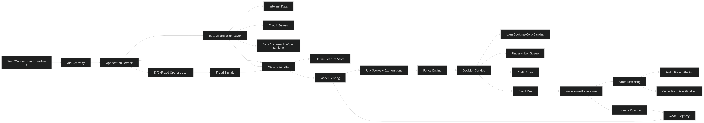
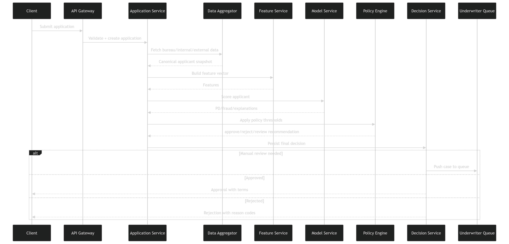

# Credit Risk Management System Design

**Use case:** Loaning agency / bank
**Goal:** Build a production-grade platform for **credit decisioning, risk scoring, limit management, monitoring, and portfolio risk control**.

---

## 1. Problem framing

A bank does not only need a model that says **approve / reject**.

A real credit risk platform must support the full lifecycle:

1. **Application intake**
2. **KYC / identity / fraud checks**
3. **Credit bureau + bank statement + internal history ingestion**
4. **Feature generation**
5. **Real-time credit scoring**
6. **Policy engine decision**
7. **Underwriter review for edge cases**
8. **Loan booking**
9. **Post-loan monitoring**
10. **Early warning, delinquency prediction, collections prioritization**
11. **Portfolio analytics, compliance, auditability, retraining**

So the right design is not just “serve an ML model.”
It is a **risk decision platform** with strong controls, low latency, traceability, and regulatory readiness.

---

# 2. Scope

We will design for these products:

* Personal loans
* Credit cards
* SME loans
* Buy-now-pay-later style short loans

We will support:

* **Real-time decisioning** for new applications
* **Batch portfolio monitoring** for existing customers
* **Human-in-the-loop review**
* **Model governance and explainability**
* **Regulatory audit and adverse action reasons**

---

# 3. Functional requirements

## 3.1 Loan application intake

* Accept applications from web, mobile, branch, partner APIs
* Capture applicant details:

  * identity
  * income
  * employment
  * requested amount
  * tenure
  * collateral if applicable
  * consent flags
* Accept supporting docs:

  * payslips
  * bank statements
  * tax returns
  * company docs for SMEs

## 3.2 Identity / compliance checks

* KYC / AML screening
* sanctions / PEP checks
* document validation
* duplicate identity detection
* fraud signals

## 3.3 Data aggregation

Fetch and unify:

* internal banking history
* repayment history
* prior defaults
* existing balances
* transaction patterns
* bureau data
* open banking / bank statement data
* device / geo / behavioral fraud signals
* macroeconomic and regional signals

## 3.4 Feature engineering

Generate features for:

* borrower creditworthiness
* affordability
* utilization
* stability
* fraud risk
* delinquency likelihood
* expected loss estimation

## 3.5 Decisioning

Support:

* approve
* reject
* refer to manual review
* approve with lower limit
* approve with higher interest / tighter conditions

## 3.6 Explainability

* Produce top contributing factors
* Produce reason codes for rejection / adverse action
* Support regulator-facing and customer-facing explanations

## 3.7 Underwriter workflow

* Queue edge cases
* show raw inputs + model outputs + explanations
* allow override with reason
* capture SLA and audit trail

## 3.8 Loan booking

* create loan account
* attach pricing, terms, limits, repayment schedule
* notify downstream core banking / servicing systems

## 3.9 Portfolio monitoring

* periodic re-score
* delinquency risk prediction
* early warning for deteriorating borrowers
* exposure tracking by segment / geography / industry
* concentration risk alerts

## 3.10 Collections support

* prioritize accounts by expected recovery / roll-rate risk
* recommend treatment strategy
* flag hardship or restructuring candidates

## 3.11 Model lifecycle

* offline training
* validation
* shadow deployment
* champion-challenger rollout
* monitoring for drift and performance decay
* rollback

## 3.12 Audit / compliance

* immutable decision logs
* versioned model + feature store + policy rules
* reproducible decisions
* retention controls
* consent-aware access

---

# 4. Non-functional requirements

## 4.1 Latency

For online loan approval:

* p50 < 150 ms for internal score only
* p95 < 400 ms excluding external bureau latency
* p99 < 800 ms for full decision where possible
* graceful degradation when external data is slow

## 4.2 Availability

* decisioning service: **99.95%**
* underwriting UI: **99.9%**
* monitoring / batch pipelines: **99.5%**

## 4.3 Consistency

* strong consistency for:

  * final decision record
  * loan booking
  * policy versions
  * audit log append
* eventual consistency acceptable for:

  * monitoring dashboards
  * portfolio aggregates
  * training datasets

## 4.4 Security

* PII encryption at rest and in transit
* RBAC / ABAC
* tokenization for sensitive fields
* field-level masking
* HSM-backed key management
* full audit logging

## 4.5 Compliance

Depending on region:

* FCRA / ECOA style adverse action support
* GDPR / CCPA style data rights
* Basel / IFRS9 style risk reporting support
* model governance / validation artifacts

## 4.6 Explainability and reproducibility

Every decision must be reproducible from:

* application snapshot
* external fetch responses
* feature vector version
* policy version
* model version
* explanation output

## 4.7 Scalability

* handle daily bursts from campaigns
* support peak traffic during business hours
* support batch scoring of millions of active accounts

## 4.8 Operability

* full observability
* model and data drift alerts
* replay capability
* dead-letter queues
* manual fallback workflow

---

# 5. Core ML objectives

Credit risk is not one metric problem. We usually build **multiple models**.

## 5.1 Models to include

1. **Application credit risk model**

   * predict probability of default (PD)
2. **Fraud / synthetic identity model**
3. **Affordability / income verification model**
4. **Loss given default (LGD) model**
5. **Exposure at default (EAD) model**
6. **Delinquency / early warning model**
7. **Collections prioritization model**

## 5.2 Business outputs

From these predictions, decision engine can derive:

* approve / reject
* APR / pricing tier
* credit limit
* collateral requirement
* manual review routing
* collections queue priority
* expected loss reserve estimate

---

# 6. Metrics to optimize

Do not say only “accuracy.” That is weak for this domain.

## 6.1 Model metrics

### For default prediction

* AUC-ROC
* PR-AUC
* KS statistic
* Recall on bad loans
* Precision on bad loans
* Brier score / calibration error
* Log loss

### For fraud model

* Recall at fixed false positive rate
* Precision@topK investigations
* PR-AUC

### For collections prioritization

* Lift in top deciles
* Recovery rate
* Cure rate
* roll-rate reduction

## 6.2 Decision system metrics

* approval rate
* bad rate among approved
* first payment default rate
* delinquency at 30/60/90 DPD
* expected loss
* net interest margin adjusted for loss
* manual review rate
* override rate
* override disagreement rate
* time to decision
* time in manual review
* external vendor timeout rate

## 6.3 Fairness / policy metrics

* segment-wise approval parity
* segment-wise bad rate
* calibration by protected or monitored groups
* adverse impact ratio
* drift by demographic proxy segments where legally allowed

## 6.4 Platform metrics

* scoring latency p50/p95/p99
* feature fetch latency
* online feature freshness lag
* training pipeline success rate
* data quality issue counts
* decision service availability
* queue backlog
* model drift alert counts

---

# 7. Back-of-the-envelope estimation

Let us assume a mid-large retail bank.

## 7.1 Traffic assumptions

* 5 million active customers
* 200,000 loan applications/day average
* peak 10x during campaigns
* 50 million active loan accounts to monitor monthly
* 2 million accounts batch-rescored daily
* average 20 features from application form
* 200–1000 engineered features after joins and transforms

## 7.2 Online QPS

200,000 applications/day:

* average QPS = 200,000 / 86,400 ≈ **2.3 req/s**
* with business-hour concentration and campaign bursts, say peak = **100–300 req/s**
* add retries, partner APIs, pre-checks, shadow traffic → design for **500 req/s**

That is not internet-scale, but risk systems are heavy because:

* many external calls
* strict logging
* feature joins
* explanation generation
* compliance overhead

## 7.3 Batch scoring

2 million accounts/day for monitoring:

* if done in 4 hours:
* 2,000,000 / 14,400 ≈ **139 records/s**

This is trivial for distributed batch systems.

If monthly IFRS-like portfolio scoring needs 50 million accounts in 6 hours:

* 50,000,000 / 21,600 ≈ **2315 records/s**

Still manageable with Spark / Flink / Ray / warehouse-native batch.

## 7.4 Storage estimation

Assume:

* each application raw payload: 20 KB
* enriched bureau + external response snapshot: 50 KB
* feature vector + explanations + audit metadata: 10 KB
* decision log record: 5 KB

Total per application ≈ **85 KB**

For 200,000/day:

* 17 GB/day
* ~510 GB/month
* ~6.1 TB/year before replication and indexes

Document uploads are much larger. If average docs = 1 MB/application:

* 200 GB/day
* ~73 TB/year

So:

* structured data in OLTP + warehouse
* docs in object storage
* immutable logs in cheaper tiered storage

## 7.5 Latency budget

For real-time decision:

* API gateway/auth: 10 ms
* application validation: 15 ms
* internal feature fetch: 20 ms
* external bureau call: 100–300 ms
* model scoring: 10–30 ms
* explanation generation: 20 ms
* policy engine: 5–10 ms
* decision persistence + event publish: 20 ms

Total p95: around **250–450 ms**, mostly dominated by external data.

---

# 8. High-level architecture

```text
Clients / Channels
    -> API Gateway
    -> Application Service
    -> KYC/Fraud Orchestrator
    -> Data Aggregation Layer
    -> Feature Service / Online Feature Store
    -> Model Serving Service
    -> Policy Engine
    -> Decision Service
    -> Loan Booking / Core Banking Integration

Async side:
    -> Event Bus / Kafka
    -> Raw Data Lake
    -> Feature Pipelines
    -> Training Pipelines
    -> Monitoring + Drift Detection
    -> Portfolio Analytics
    -> Underwriter Workbench
    -> Audit / Governance Store
```

---

# 9. HLD components

## 9.1 API Gateway

Responsibilities:

* authentication
* rate limiting
* request routing
* partner API access control
* request tracing

## 9.2 Application Service

* validate application schema
* dedupe submissions
* create application ID
* persist initial state
* trigger orchestration

## 9.3 KYC / Fraud Orchestrator

* call identity verification services
* sanctions / AML provider
* fraud model
* document OCR if needed
* emit risk flags

## 9.4 Data Aggregation Layer

* fetch internal account data
* fetch bureau reports
* fetch bank statements / open banking
* fetch employer verification if available
* normalize all payloads into canonical format

## 9.5 Feature Service

* compute or retrieve online features
* join latest customer profile, bureau summary, transaction aggregates
* maintain consistent feature definitions between training and serving

## 9.6 Online Feature Store

* low-latency lookup for serving
* point-in-time correctness
* feature versioning
* freshness metadata

## 9.7 Model Serving Service

* serve multiple models
* support champion/challenger
* return:

  * PD
  * fraud score
  * affordability score
  * explanation vectors
  * confidence / missing-feature flags

## 9.8 Policy Engine

Deterministic rules around model outputs:

* reject if sanctions hit
* refer if bureau missing
* cap limit if thin file
* reject if DTI above threshold
* pricing tiers by PD bucket
* segment-specific policy rules

This is important:
**Banks do not let the model directly make the final decision without policy controls.**

## 9.9 Decision Service

* merge model results + rule outcomes
* produce final decision object
* persist immutable audit record
* publish event to downstream systems

## 9.10 Underwriter Workbench

* queue manual reviews
* show explanations and data lineage
* accept override decisions
* enforce maker-checker if needed

## 9.11 Batch / Analytics Platform

* nightly rescoring
* vintage analysis
* delinquency tracking
* cohort analysis
* portfolio concentration monitoring
* reporting for finance / risk

## 9.12 Monitoring and Governance

* data quality checks
* training-serving skew detection
* drift detection
* calibration monitoring
* fairness monitoring
* approval / bad-rate monitoring

---

# 10. HLD data flow

## 10.1 Real-time application flow

1. Client submits application
2. Application Service validates and stores request
3. KYC/Fraud Orchestrator runs checks
4. Data Aggregation fetches bureau/internal/external data
5. Feature Service builds online feature vector
6. Model Serving returns scores and explanations
7. Policy Engine applies thresholds and rules
8. Decision Service stores final decision
9. If approved, Loan Booking Service creates loan
10. Events are published for analytics, audit, and retraining

## 10.2 Batch monitoring flow

1. Active accounts exported from servicing/core banking
2. Batch feature pipeline computes updated features
3. Monitoring models score default / delinquency / loss risk
4. Accounts segmented into watchlists
5. Alerts sent to risk ops / collections
6. Outputs written to warehouse and dashboards

---

# 11. Low-level design

## 11.1 Core entities

### Application

```text
application_id
customer_id
product_type
requested_amount
tenure
channel
submitted_at
application_status
consent_flags
raw_payload_ref
```

### Customer Profile

```text
customer_id
kyc_status
employment_type
declared_income
verified_income
existing_relationship_length
internal_risk_segment
country
region
```

### Bureau Snapshot

```text
bureau_snapshot_id
customer_id
credit_score
num_open_trades
num_delinquencies
total_outstanding_balance
credit_utilization
hard_inquiries_6m
thin_file_flag
snapshot_time
raw_report_ref
```

### Feature Vector

```text
feature_vector_id
application_id
feature_version
feature_timestamp
features_blob
missing_feature_flags
```

### Model Prediction

```text
prediction_id
application_id
model_name
model_version
score_type
score_value
calibrated_score
top_features
prediction_timestamp
```

### Policy Evaluation

```text
policy_eval_id
application_id
policy_version
rules_triggered
decision_recommendation
pricing_tier
limit_recommendation
```

### Final Decision

```text
decision_id
application_id
final_status
approved_amount
pricing
reason_codes
manual_review_required
decision_timestamp
decision_trace_ref
```

### Underwriter Action

```text
review_id
application_id
reviewer_id
action
override_reason
comments
timestamp
```

---

## 11.2 API design

### Submit application

`POST /applications`

Request:

```json
{
  "customer_id": "123",
  "product_type": "personal_loan",
  "requested_amount": 15000,
  "tenure_months": 36,
  "declared_income": 90000,
  "employment_type": "salaried",
  "consent": {
    "bureau_pull": true,
    "data_processing": true
  }
}
```

Response:

```json
{
  "application_id": "app_789",
  "status": "RECEIVED"
}
```

### Get decision

`GET /applications/{id}/decision`

### Underwriter queue

`GET /underwriting/queue`

### Underwriter action

`POST /underwriting/{application_id}/action`

### Rescore portfolio

`POST /portfolio/rescore-job`

### Model metadata

`GET /models/{model_name}/versions/{version}`

---

## 11.3 Database choices

### OLTP database

Use PostgreSQL / Aurora / Spanner-like system for:

* applications
* decisions
* policy configs
* underwriter actions
* workflow states

Why:

* relational integrity
* audit-friendly
* transactional behavior
* easy querying for case management

### Object storage

Use S3 / GCS / Blob store for:

* uploaded docs
* bureau raw payload snapshots
* model artifacts
* immutable decision traces
* training datasets

### Feature store

* online KV / low-latency store: Redis / DynamoDB / Cassandra-backed feature store
* offline store: warehouse/lakehouse

### Warehouse / lakehouse

Use Snowflake / BigQuery / Redshift / Databricks for:

* training data
* portfolio analytics
* risk dashboards
* monitoring aggregates

### Search index

Elastic/OpenSearch for:

* underwriter search
* audit investigation
* case filtering

### Event bus

Kafka / PubSub / Kinesis for:

* decoupled asynchronous events
* retries
* audit fanout
* model monitoring feed

---

# 12. Model design

## 12.1 Application risk model

Inputs:

* bureau summary
* declared vs verified income
* DTI ratio
* utilization
* employment stability
* existing relationship
* prior delinquency
* transactional cashflow indicators

Output:

* probability of default in next X months

Candidates:

* logistic regression baseline
* gradient boosting trees
* XGBoost / LightGBM / CatBoost
* possibly neural nets for larger heterogeneous data, but trees usually strong here

Interview point:
For tabular finance data, **GBDT models are often the practical default** because:

* strong performance
* interpretable enough
* work well with missing values / nonlinear interactions
* easier governance than deep nets

## 12.2 Fraud model

Inputs:

* device fingerprint
* geolocation mismatch
* identity consistency
* doc validation signals
* velocity features
* behavioral biometrics if available

## 12.3 Delinquency model

Inputs:

* repayment behavior
* missed payment recency
* utilization spikes
* income inflow deterioration
* recent hardship indicators
* customer service interactions if permitted

---

# 13. Data preprocessing

This part matters a lot in credit systems.

## 13.1 Data cleaning

* schema validation
* remove duplicate applications
* normalize categorical values
* currency normalization
* timezone normalization
* missing value tagging
* outlier clipping / winsorization where appropriate

## 13.2 Label definition

For default model:

* define bad outcome clearly:

  * 30+ DPD?
  * 60+ DPD?
  * charged off?
  * default within 12 months?
* ensure consistent observation window and performance window

Bad label quality ruins the system.

## 13.3 Point-in-time correctness

You must avoid leakage:

* only use data known at application time
* no future repayment info
* no backfilled bureau updates that were unavailable at decision time

## 13.4 Feature engineering examples

* debt-to-income ratio
* payment-to-income ratio
* credit utilization
* average account age
* number of recent inquiries
* salary volatility
* average monthly inflow/outflow
* bounce rate
* overdraft frequency
* internal delinquency count
* relationship tenure
* loan-to-value for secured lending

## 13.5 Missing data handling

Missingness itself is informative:

* no bureau hit
* no salary credit pattern
* unverifiable employment
* new-to-bank customer

So:

* impute where needed
* also add missing indicator flags

## 13.6 Categorical handling

* one-hot for small-cardinality
* target encoding with care and leakage controls
* native categorical handling if using CatBoost-like systems

## 13.7 Class imbalance treatment

Default and fraud are imbalanced. Use:

* class weights
* focal loss where relevant
* downsample majority or stratified sampling
* threshold tuning by business cost
* PR-AUC and recall-at-fixed-FPR tracking

## 13.8 Calibration

Essential. A PD model should be well calibrated.
Use:

* isotonic regression
* Platt scaling
* segment-wise calibration checks

Because pricing and reserves depend on calibrated probabilities, not just ranking.

---

# 14. Training pipeline

## 14.1 Offline pipeline stages

1. ingest raw historical data
2. point-in-time joins
3. label generation
4. train-validation-test split by time
5. feature computation
6. train baseline and candidate models
7. evaluate discrimination + calibration + fairness
8. generate explainability artifacts
9. register model in model registry
10. deploy to shadow / challenger

## 14.2 Split strategy

Do **time-based split**, not random split.
Reason:

* credit risk is temporal
* macro conditions shift
* random split leaks distributional similarity

Example:

* train: Jan–Sep
* validation: Oct–Nov
* test: Dec

## 14.3 Retraining cadence

* monthly for default model
* weekly or daily for fraud
* quarterly for some slower-changing scorecards
* emergency retraining if drift severe

---

# 15. Online serving design

## 15.1 Serving path

* request arrives
* fetch precomputed customer features
* compute request-dependent features
* run model
* calibrate score
* generate explanation
* pass to rules engine
* persist decision

## 15.2 Why split features?

Some features are:

* **precomputed**: relationship tenure, historical delinquency count
* **request-time**: requested amount / income ratio, DTI with new loan, loan installment burden

This reduces latency.

## 15.3 Resilience patterns

* bureau call timeout budget
* cached bureau summary where legally allowed
* fallback policy if bureau unavailable:

  * manual review
  * soft reject
  * limited approval for existing customers only
* circuit breaker around vendors
* idempotent retries

---

# 16. Decision engine design

Final decision often looks like:

```text
if sanctions_hit -> reject
else if fraud_score > hard_threshold -> reject
else if missing_critical_data -> manual_review
else if PD > reject_threshold -> reject
else if PD between review_low and review_high -> manual_review
else approve with pricing/limit based on PD bucket and affordability
```

Add overlays:

* thin file handling
* secured/unsecured product rules
* product-specific minimum income
* geography/industry exposure caps
* concentration risk caps

So the architecture is:
**ML score suggests risk, policy engine enforces business and regulatory controls.**

---

# 17. Explainability design

You will get asked this.

## 17.1 Need

Banks often must provide:

* adverse action reasons
* underwriter explanations
* model validation transparency

## 17.2 Techniques

* SHAP for tree models
* monotonic constraints in model design where useful
* scorecards for highly regulated simpler products
* reason-code mapping layer

## 17.3 Separate explanation consumers

* **customer-facing:** simple reason codes
* **underwriter-facing:** detailed factor contributions
* **validator/auditor-facing:** model documentation, segment behavior, calibration

---

# 18. Monitoring

## 18.1 Data quality monitoring

* null rate shifts
* schema drift
* vendor missing field spikes
* impossible values
* delayed ingestion

## 18.2 Feature monitoring

* distribution drift
* PSI
* KS shift
* training-serving skew
* freshness lag

## 18.3 Model monitoring

* approval rate shift
* bad rate by decile
* calibration decay
* segment-wise recall / precision
* champion vs challenger comparison

## 18.4 Business monitoring

* delinquency trend
* vintage curves
* first payment default
* portfolio loss
* manual review backlog
* override patterns
* external provider SLA

---

# 19. Fairness and governance

This is a must-mention section in interviews.

## 19.1 Risks

* proxy bias
* unfair rejection of protected groups
* region/language/income documentation bias
* historical bias in training labels

## 19.2 Controls

* exclude prohibited fields where required
* careful use of correlated proxies
* segment-wise monitoring
* fairness evaluation pre-deployment
* human review for borderline cases
* model risk committee approval
* documented override and appeal workflows

## 19.3 Governance assets

* model card
* training dataset version
* feature definition registry
* validation report
* approval memo
* rollback plan
* monitoring thresholds

---

# 20. Deployment strategy

## 20.1 Environments

* dev
* staging
* pre-prod
* prod

## 20.2 Deployment units

* application service
* feature service
* model serving
* policy engine
* underwriting UI
* batch pipelines
* monitoring jobs

## 20.3 Infra

Use Kubernetes for stateless services:

* API gateway
* scoring service
* rules engine
* underwriting backend
* monitoring APIs

Use managed data systems for:

* OLTP DB
* warehouse
* object storage
* Kafka if managed available

## 20.4 Release strategy

* canary for model serving
* shadow scoring for new models
* champion-challenger evaluation
* feature flags for new policy rules
* blue-green for critical APIs

## 20.5 Rollback

* previous model version in registry
* previous feature transformation version
* policy rule version rollback
* fail-safe route to manual review if scoring unavailable

---

# 21. Security design

## 21.1 Data classification

* PII
* financial data
* behavioral signals
* model outputs
* derived risk flags

## 21.2 Controls

* TLS everywhere
* encryption at rest
* secrets in vault
* row/column level access
* tokenization for SSN/national ID
* separate prod and analytics access
* break-glass audited access
* data retention lifecycle

## 21.3 Audit

Every access to:

* applicant data
* bureau data
* decision output
* override action
  must be logged.

---

# 22. Failure scenarios and mitigation

## 22.1 Bureau provider down

* retry with jitter
* circuit breaker
* use cached internal-only precheck
* fallback to manual review

## 22.2 Feature store unavailable

* compute minimal fallback features from request + OLTP
* degrade to conservative policy
* mark decision as low-confidence

## 22.3 Model service latency spike

* autoscale
* cache model artifact in memory
* use lighter model fallback
* route to manual review after threshold

## 22.4 Training pipeline bug

* keep champion model active
* quarantine candidate
* require validation signoff before promotion

## 22.5 Drift after macro shock

* tighten thresholds
* increase manual review band
* trigger expedited retraining
* monitor vintage curves more frequently

---

# 23. Tradeoffs

## 23.1 Simpler scorecard vs complex ML

**Scorecard**

* easier to explain
* easier regulator acceptance
* weaker nonlinear learning

**GBDT**

* usually better performance
* still interpretable enough with SHAP
* more governance work

## 23.2 Real-time bureau fetch vs cached bureau summary

**Real-time**

* fresher
* slower
* more vendor dependency

**Cached**

* faster
* cheaper
* potentially stale

## 23.3 Full automation vs manual review band

**Full automation**

* lower ops cost
* riskier for edge cases

**Manual review band**

* safer
* slower
* expensive

## 23.4 Monolith vs microservices

For interview answer:

* start with modular monolith if small org
* evolve to microservices around ingestion, scoring, decisioning, monitoring as scale/compliance grows

That is the sane answer.

---

# 24. Suggested tech stack

## Serving

* Backend: Java / Kotlin / Go / Python FastAPI depending org style
* Model serving: Python service or Triton / Bento / custom
* Rules engine: Drools / Open Policy Agent / custom rule evaluator
* API gateway: Kong / Envoy / cloud-native gateway

## Data

* OLTP: PostgreSQL / Aurora
* Cache / online store: Redis / DynamoDB / Cassandra
* Event bus: Kafka
* Warehouse: BigQuery / Snowflake / Databricks
* Object store: S3 / GCS

## ML / Data processing

* Spark / Flink / Beam
* Airflow / Dagster / Argo
* Feast-like feature store or internal equivalent
* MLflow / model registry
* Evidently / custom drift monitoring

## Observability

* Prometheus
* Grafana
* OpenTelemetry
* ELK/OpenSearch

---

# 25. Interview-ready system decomposition

If interviewer says “design credit risk system,” split into 5 layers:

## Layer 1: Ingestion

* apps, docs, bureau, internal systems

## Layer 2: Risk intelligence

* features, models, explanations

## Layer 3: Decisioning

* rules + thresholds + pricing + manual review

## Layer 4: Lifecycle operations

* booking, monitoring, collections, portfolio views

## Layer 5: Governance

* audit, fairness, drift, compliance, rollback

That framing sounds strong.

---

# 26. What to emphasize in interview

1. **This is not just a classifier**

   * it is a regulated decision system

2. **Model is not enough**

   * rules engine and auditability are first-class

3. **Calibration matters**

   * PD must be meaningful, not only rank-order good

4. **Point-in-time correctness matters**

   * leakage is deadly in credit models

5. **Manual review is necessary**

   * for uncertainty, fairness, missing data, exceptions

6. **Post-loan monitoring matters**

   * risk does not end at approval

7. **Governance matters**

   * versioning, reproducibility, adverse action reasons

---

# 27. Compact architecture diagram



---

# 28. Low-level scoring sequence



---

# 29. Extensions

If interviewer pushes further, add these:

## 29.1 SME / commercial lending

Need extra modules:

* financial statement parsing
* sector risk
* guarantor network
* cashflow analysis
* collateral valuation

## 29.2 Dynamic limit management

For cards / BNPL:

* periodic line increase/decrease
* transaction-level risk checks
* merchant concentration analysis

## 29.3 Graph risk

Use graph features for:

* synthetic identity rings
* shared device / address / employer anomalies
* fraud network detection

---

# 30. Final summary

A production-ready credit risk platform should include:

* **real-time application decisioning**
* **multi-model risk scoring**
* **policy engine**
* **manual review**
* **loan booking integration**
* **portfolio monitoring**
* **collections prioritization**
* **fairness, explainability, and governance**
* **versioned, reproducible, auditable decisions**

The strongest interview answer is to show that you understand:

* ML
* systems
* regulation
* operations
* and the gap between a model and a bank-ready product
