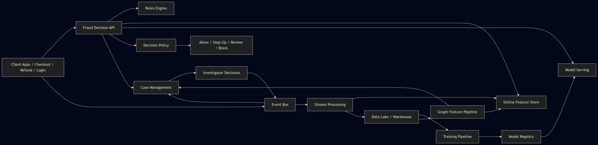

# Fraud Detection System Design for E-Commerce

## 1. Problem Statement

Design a production-ready fraud detection platform for an e-commerce marketplace like Amazon that can detect and prevent abuse across:

* **Orders**: fake orders, reshipping abuse, account takeover purchases, promo abuse
* **Payments**: stolen cards, card testing, friendly fraud, synthetic identities
* **Refunds / Returns**: refund without return, empty-box return, return policy abuse, repeated damaged-item claims
* **Accounts / Devices**: multi-account abuse, bot-driven checkout, referral abuse, gift-card abuse
* **Merchants / Sellers**: collusive seller-buyer activity, fake reviews tied to orders, abnormal refund behavior

The system must make decisions in **real time** for critical flows and also support **batch/offline detection** for long-horizon patterns.

---

## 2. Goals

### Primary goals

* Stop fraudulent transactions before financial loss happens
* Reduce false positives on legitimate customers
* Support real-time risk scoring during checkout, refund request, and account events
* Continuously learn from delayed labels such as chargebacks, disputes, confirmed abuse, manual investigator decisions
* Provide investigators and policy teams with explainability and case tooling

### Secondary goals

* Support experimentation on rules and ML models
* Provide feature freshness guarantees
* Handle concept drift and adversarial adaptation
* Maintain low decision latency for user-facing flows

### Out of scope

* Full payment processor implementation
* Full AML/KYC platform
* Seller recommendation or pricing systems

---

## 3. Fraud Use Cases

### 3.1 Order fraud

* Stolen credit card used for high-value items
* Sudden spike in orders from a new account
* Mismatch between shipping region, device region, and card country
* Many accounts shipping to same address or nearby address cluster
* High-risk cart composition: resale-friendly items, gift cards, electronics

### 3.2 Payment fraud

* Card testing using many low-value attempts
* Repeated authorization failures across many cards on same device/IP
* Velocity abuse on payment instrument
* Synthetic identity with thin history but aggressive spend

### 3.3 Refund and return abuse

* Customer repeatedly claims item not received
* Refund requested immediately after delivery with suspicious pattern
* Same customer repeatedly returns high-value items with abnormal return reasons
* Empty-box or box-swap abuse flagged via warehouse scan mismatch

### 3.4 Promotion / policy abuse

* Coupon farming with multi-account setup
* Referral abuse using account graph collusion
* New-user benefit abuse with device/address reuse

### 3.5 Account and device abuse

* Bot-created accounts
* Account takeover after credential stuffing
* Suspicious login + address update + expensive order sequence

---

## 4. Functional Requirements

### 4.1 Event ingestion

System should ingest events from:

* account creation/login/password reset
* device fingerprint events
* cart and checkout events
* payment auth and decline events
* order creation, shipment, delivery
* refund/return request lifecycle
* customer support interactions
* warehouse inspection outcomes
* dispute / chargeback / manual review outcomes

### 4.2 Real-time scoring

For a given action, system should:

* fetch latest features
* compute fraud risk score
* apply rules and model inference
* return a decision within SLA

Supported decisions:

* **allow**
* **allow + monitor**
* **step-up verification** (OTP, CVV, re-auth, ID check)
* **manual review**
* **block / hold**

### 4.3 Rule engine

* Policy teams should be able to define deterministic rules
* Rules should support thresholds, windows, entity joins, lists, and geographic predicates
* Rules should be versioned and auditable

### 4.4 ML scoring

* Support supervised binary classification for fraud vs non-fraud
* Support anomaly scoring / unsupervised models for emerging attacks
* Support model versioning, shadow deployment, and champion-challenger

### 4.5 Feature store

* Real-time online features for inference
* Offline historical feature store for training and backfills
* Point-in-time correct training data generation

### 4.6 Case management

* Create review queues for suspicious transactions
* Provide reason codes, feature attributions, linked entities, and history
* Allow investigator disposition: confirmed fraud / legitimate / uncertain

### 4.7 Feedback loop

System should ingest delayed labels from:

* chargebacks
* bank disputes
* confirmed refund abuse
* warehouse inspection findings
* investigator decisions
* customer appeals

### 4.8 Monitoring

* latency and availability for scoring APIs
* drift monitoring for input features and prediction distribution
* business metrics: fraud rate, false positives, loss prevented

### 4.9 Audit and compliance

* retain decisions, model version, rule version, feature snapshot references
* support replay of historical decisions
* support PII access controls and redaction

---

## 5. Non-Functional Requirements

### Scale

* Tens of thousands to hundreds of thousands of transactions per second globally during peaks
* Millions of daily refund and return events
* Billions of long-term historical events for graph and sequence analysis

### Latency

* Checkout/payment fraud scoring: **p95 < 100 ms**, ideally **p95 < 50 ms**
* Refund scoring: **p95 < 200 ms**
* Manual review queue update: near real time, within a few seconds
* Batch risk recomputation: hourly or daily depending on use case

### Availability

* Real-time decisioning service: **99.99%** target for critical payment/order path
* Graceful degradation if model/features unavailable

### Consistency

* Strong consistency not required across the whole platform
* Latest entity counters should be close to real time
* Decisioning path must favor availability with bounded staleness

### Reliability

* No dropped events in core fraud pipeline
* Idempotent ingestion and scoring
* Replay capability from durable log

### Security

* PII encryption at rest and in transit
* strict RBAC for investigators, analysts, model developers
* tokenization for payment identifiers

### Explainability

* Risk reason codes must be available for every action taken
* Manual reviewers must understand why transaction was flagged

---

## 6. Key Metrics to Optimize

Fraud systems are multi-objective. Maximizing one metric blindly causes business damage.

### Model metrics

* **Precision**: of flagged transactions, how many were actually fraud
* **Recall**: of all fraud, how much we caught
* **F1**: useful when balancing precision and recall
* **PR-AUC**: better than ROC-AUC for imbalanced fraud data
* **ROC-AUC**: useful but less informative under severe imbalance
* **Log loss / calibration error**: important if scores map to thresholds and expected loss

### Business metrics

* **Fraud loss rate** = fraud dollars / gross merchandise value
* **Chargeback rate**
* **False positive rate on good users**
* **Good user friction rate** = percent of legit users forced into OTP/manual review/block
* **Approval rate**
* **Manual review rate**
* **Loss prevented**
* **Refund abuse rate**
* **Investigator productivity** = cases closed/hour

### System metrics

* API p50/p95/p99 latency
* timeout rate
* event lag in streaming pipeline
* online feature freshness lag
* model inference error rate
* rule engine evaluation time

### Fairness / operational metrics

* segment-wise false positive rates by geography, payment type, customer tenure
* drift metrics: PSI, KL divergence, feature missingness shifts

---

## 7. High-Level Design

## 7.1 Core idea

Use a **hybrid fraud architecture**:

1. **Streaming event pipeline** to collect all actions
2. **Real-time feature computation** for counters and entity history
3. **Decision engine** combining rules + ML + policy thresholds
4. **Case management system** for manual investigation
5. **Offline training and batch analytics** for long-horizon detection and model refresh
6. **Graph/relationship analysis** for linked abuse rings

## 7.2 Main components

### A. Event Producers

* web/mobile apps
* payment service
* order service
* refund service
* auth/account service
* warehouse systems
* customer support systems

### B. Event Bus

* Kafka / Pulsar / Kinesis
* Topics by domain: account-events, payment-events, order-events, refund-events, investigator-labels

### C. Stream Processing Layer

* Flink / Spark Structured Streaming / Kafka Streams
* computes rolling counters, windows, stateful aggregations
* detects velocity rules and suspicious sequences
* writes online features and raw events

### D. Online Feature Store

* Redis / DynamoDB / Cassandra / Aerospike
* entity features by user_id, device_id, card_token, email, phone, address, IP, merchant_id

### E. Offline Data Lake / Warehouse

* S3 + Parquet + Hive/Iceberg/Delta
* warehouse like BigQuery/Snowflake/Redshift for analytics

### F. Decision Engine

* synchronous API on checkout/payment/refund path
* fetches online features
* evaluates rules
* invokes ML model service
* returns action and reason codes

### G. Model Serving Layer

* low-latency model server
* supports tree models, linear models, graph scores, sequence model outputs
* can serve precomputed graph risk score + online model score together

### H. Rules Engine

* deterministic policy layer
* hotlists, allowlists, blocklists, country restrictions, velocity thresholds

### I. Case Management / Investigation UI

* suspicious queue
* entity graph explorer
* evidence timeline
* action history

### J. Training / Labeling Pipeline

* builds point-in-time features
* joins delayed labels
* trains and validates models
* registers model artifacts

### K. Monitoring & Experimentation

* model performance dashboards
* drift dashboards
* A/B and shadow testing

---

## 8. End-to-End Request Flow

### 8.1 Checkout / payment decision flow

1. User clicks place order
2. Checkout service calls Fraud Decision API with transaction context
3. Fraud API fetches entity features from online feature store
4. Rules engine runs hard rules first
5. If not blocked immediately, model service generates fraud score
6. Decision policy converts score into action using thresholds and business context
7. Fraud API returns allow / step-up / review / block
8. Decision and features snapshot references are logged asynchronously
9. Event is emitted to streaming pipeline for downstream learning

### 8.2 Refund decision flow

1. Refund requested
2. Refund service sends request to Fraud API
3. Fraud API loads customer refund history, return reasons, item patterns, warehouse mismatch indicators
4. Rules + model score evaluate risk
5. Possible actions:

   * instant refund
   * refund after item receipt
   * manual inspection hold
   * deny and escalate

### 8.3 Offline feedback flow

1. Chargebacks and confirmed fraud outcomes arrive days/weeks later
2. Label pipeline resolves entity and transaction label
3. Offline trainer builds training set with point-in-time correct features
4. New model trained and validated
5. Model deployed in shadow mode
6. After successful evaluation, thresholds updated and model promoted

---

## 9. Back-of-the-Envelope Estimation

Assume a large marketplace scale.

### Traffic assumptions

* 300 million daily active users globally
* 80 million orders/day
* Peak checkout QPS = **150k/sec** during high-traffic events
* 5 payment attempts per successful order on average at peak abuse periods is too high for normal traffic; assume **1.2 payment attempts/order** average
* Refund/return requests = **3 million/day**
* Account/auth/device events = **5 billion/day**

### Real-time scoring volume

* Orders requiring risk evaluation: 80M/day
* Payment attempts: 96M/day
* Refund requests: 3M/day
* Account takeover / login risk events: maybe 1B/day subset scored with lightweight path

For critical synchronous decisioning, assume:

* checkout/payment scoring peak = **150k QPS**
* refund scoring peak = **10k QPS**

### Event storage

Assume average raw event size after serialization = 1 KB

* 5B events/day => 5 TB/day raw
* With replication x3 in Kafka => 15 TB/day transient bus footprint
* Long-term compressed parquet maybe ~20–30% of raw depending on schema => roughly 1–1.5 TB/day stored

### Online feature store footprint

Suppose active keys over rolling windows:

* 200M user entities
* 100M device entities
* 500M payment/address/email/IP composite entities
* average online feature blob = 1 KB

Total active online state roughly:

* 800M keys * 1 KB = **~800 GB** raw
* with overhead + replication, provision multi-TB distributed KV store

### Decision service compute

If one scoring request consumes 5 ms CPU on average at app layer and 2 ms model inference CPU equivalent:

* at 150k QPS, raw CPU-seconds/sec = 150,000 * 0.007 = 1,050 CPU-sec/sec
* roughly **1,050 vCPUs** before headroom
* with 2x headroom + regional redundancy, several thousand vCPUs across regions

These are rough numbers. In interview, showing the method matters more than exact values.

---

## 10. API Design

## 10.1 Fraud scoring API

```json
POST /fraud/score
{
  "event_type": "checkout_payment",
  "request_id": "uuid",
  "timestamp": "2026-03-27T18:00:00Z",
  "user": {
    "user_id": "u123",
    "account_age_days": 2,
    "email_hash": "...",
    "phone_hash": "..."
  },
  "device": {
    "device_id": "d456",
    "ip": "1.2.3.4",
    "fingerprint_id": "fp789"
  },
  "payment": {
    "card_token": "tok_abc",
    "billing_country": "US"
  },
  "order": {
    "order_id": "o100",
    "amount": 1499.99,
    "currency": "USD",
    "items": ["sku1", "sku2"],
    "shipping_address_id": "addr55"
  }
}
```

Response:

```json
{
  "decision": "STEP_UP",
  "risk_score": 0.93,
  "reasons": [
    "new_account_high_value_order",
    "device_seen_across_multiple_accounts",
    "shipping_billing_geo_mismatch"
  ],
  "model_version": "fraud_xgb_v42",
  "rule_hits": ["R102", "R887"],
  "ttl_seconds": 300
}
```

## 10.2 Investigator disposition API

* mark confirmed fraud
* mark false positive
* add notes
* escalate to specialized queue

## 10.3 Rule management API

* create/update/publish rule versions
* dry-run against sampled traffic

---

## 11. Data Model and Entities

### Core entities

* user_id
* account_id
* order_id
* payment_instrument_token
* device_id / fingerprint_id
* email_hash / phone_hash
* IP / ASN / geolocation
* shipping_address_id / normalized_address_hash
* merchant_id / seller_id
* refund_id / return_id

### Fact tables

* transaction_events
* auth_events
* refund_events
* dispute_events
* investigator_labels
* warehouse_inspection_events

### Dimension / profile tables

* user_profile
* device_profile
* payment_profile
* address_profile
* merchant_profile

### Graph edges

* user -> device
* user -> card_token
* user -> address
* device -> IP
* card_token -> address
* multiple users -> same device / same address / same phone

Graph signals are extremely valuable in abuse detection.

---

## 12. Feature Engineering

## 12.1 Real-time features

These must be cheap and fresh.

### Velocity features

* payment attempts per card in last 5m / 1h / 24h
* distinct users per device in last 24h / 7d
* distinct cards per IP in last 1h
* refunds requested per user in last 30d
* failed logins per IP in last 15m

### Entity trust features

* account age
* verified email / phone / identity status
* historical order success rate
* historical dispute ratio
* average basket value vs current basket

### Consistency / mismatch features

* billing country != shipping country
* device geo far from shipping geo
* impossible travel between login and checkout
* first-time address + first-time card + high-value order combo

### Behavioral features

* time from account creation to first purchase
* checkout completion speed
* navigation entropy / bot-likeness
* repeated identical cart patterns

## 12.2 Offline / richer features

* historical fraud rate by SKU / seller / region
* graph centrality or suspicious community score
* sequence embeddings from event stream
* chargeback-adjusted customer lifetime trust score
* return abuse score over 6 months

## 12.3 Labels

Labels are tricky because of delay and noise.

Positive labels:

* chargeback confirmed fraud
* manual investigator confirmed abuse
* warehouse confirms return fraud
* bank/network confirmed stolen card fraud

Negative labels:

* dispute resolved in merchant favor
* reviewed and cleared transaction
* long-settled order with no fraud signal after observation window

Need explicit **label maturity windows**. Example:

* payment fraud labels mature after 45–90 days
* refund abuse labels may mature after warehouse/customer support closure

---

## 13. Data Preprocessing Pipeline

Fraud data preprocessing is more than cleaning columns.

### 13.1 Data cleaning

* deduplicate events using idempotency keys
* normalize timestamps to UTC
* standardize currencies and convert to base currency if needed
* normalize addresses and phone formats
* tokenize payment identifiers

### 13.2 Entity resolution

* link same person across email variants, devices, addresses, cards when allowed
* household vs fraud ring disambiguation matters to avoid false positives

### 13.3 Sessionization / sequence building

* build user sessions for login -> browse -> add to cart -> payment
* derive event sequences and time deltas

### 13.4 Window aggregations

* rolling counts over 5m, 1h, 1d, 7d, 30d
* distinct count sketches where exact count is expensive

### 13.5 Class imbalance handling

Fraud is highly imbalanced.

* downsample easy negatives for training
* keep recent hard negatives
* use class weights or focal loss where needed
* evaluate with PR-AUC, precision@K, expected dollar loss

### 13.6 Leakage prevention

This is a major interview talking point.

* features must only use data available before decision time
* no future chargebacks or post-event investigation data during training feature construction
* point-in-time joins are mandatory

### 13.7 Missing data handling

* explicit missingness indicators
* careful defaults for sparse entities
* distinguish new user from missing telemetry

### 13.8 Train/validation/test strategy

* time-based split, not random split
* keep most recent period as holdout to test drift robustness

---

## 14. Detection Approaches

## 14.1 Rules-based detection

Best for:

* fast response to emerging attacks
* compliance/policy requirements
* high-confidence hard blocks

Examples:

* > 10 cards attempted on same device within 10 minutes
* high-value order from new account + unmatched AVS + risky BIN country
* refund amount exceeds recent delivered inventory pattern

Pros:

* interpretable
* quick to deploy
* good for known patterns

Cons:

* brittle
* attackers adapt quickly
* expensive to maintain at large scale

## 14.2 Supervised ML

Common choices:

* logistic regression baseline
* gradient boosted trees (XGBoost/LightGBM/CatBoost) for tabular fraud
* deep sequence models for event sequences
* graph neural network / graph risk propagation for linked abuse rings

Best for:

* combining many weak signals
* ranking suspicious events by risk

## 14.3 Unsupervised / anomaly detection

Useful for:

* emerging attacks with sparse labels
* seller/refund anomalies
* device/card testing clusters

Examples:

* isolation forest
* autoencoders
* clustering-based anomaly scores

## 14.4 Graph-based detection

Very important in marketplace fraud.
Use graph features or graph model to find:

* many accounts -> same device
* many refunds -> same address cluster
* referral abuse ring
* collusive actors

## 14.5 Ensemble decisioning

Common production pattern:

* hard rules
* ML probability score
* anomaly score
* graph risk score
* business loss estimator

Final decision can be thresholded on **expected loss**, not just probability.

---

## 15. Decision Policy Design

A probability score alone is not enough.

Use policy tiers:

* **0.00–0.20**: allow
* **0.20–0.50**: allow + passive monitoring
* **0.50–0.75**: step-up authentication
* **0.75–0.90**: manual review or delayed fulfillment
* **>0.90**: block / cancel / hold refund

But threshold should depend on:

* transaction amount
* item risk category
* customer tenure
* geography
* current attack intensity
* downstream cost of false positive

A better framing:

**Expected fraud loss** = probability_of_fraud × transaction_amount × expected_recovery_factor_adjustment

Then compare expected loss to friction / review cost.

---

## 16. Detailed Low-Level Design

## 16.1 Streaming feature computation

Use Flink with keyed state.

Key streams by:

* user_id
* device_id
* payment_token
* address_hash
* IP

Maintain windowed state:

* count of attempts
* distinct count of users/cards/devices
* last seen timestamps
* exponentially decayed counters

Store outputs in:

* online feature store for inference
* long-term raw event lake for training

### Why streaming stateful compute?

Because recomputing counters from databases at inference time will miss latency targets.

## 16.2 Online feature store schema example

```text
Key: user:u123
Fields:
  account_age_days: 2
  successful_orders_90d: 1
  chargebacks_365d: 0
  refunds_30d: 4
  distinct_devices_7d: 3
  avg_order_value_90d: 120.50
  last_order_ts: 1710000000
```

```text
Key: device:d456
Fields:
  distinct_users_24h: 14
  payment_failures_1h: 22
  high_value_orders_24h: 5
  risk_cluster_score: 0.81
```

## 16.3 Rule engine internals

Rules can be compiled into executable predicates.

Rule structure:

* metadata: id, owner, version, severity
* condition tree
* time windows
* actions / reason codes

Need:

* dry-run mode
* hit-rate monitoring
* kill switch for bad rules

## 16.4 Model serving

Preferred deployment for tabular fraud:

* precompute as many expensive features as possible
* serve tree model via low-latency microservice
* cache ancillary metadata
* enforce model timeout budget, e.g. 10–20 ms

Fallback order:

1. cached score if valid
2. lightweight rules-only decision
3. conservative allow with async review for low-risk segments if system degraded

## 16.5 Case management LLD

Case record contains:

* case_id
* entity ids
* event payload snapshot
* model score
* rule hits
* feature explanations
* linked historical cases
* investigator notes
* final disposition

Need queues by:

* payment fraud
* refund abuse
* account takeover
* seller abuse
* escalation priority based on dollar risk

## 16.6 Graph service

Build periodic graph from entity links.

Option 1:

* batch graph features daily/hourly into feature store

Option 2:

* dedicated graph DB for investigation and nearline scoring

Examples of graph features:

* connected component size
* risky neighbor ratio
* shortest path to known bad entity
* number of shared devices among accounts

---

## 17. Storage Choices

### OLTP / serving

* online feature store: Redis / DynamoDB / Cassandra / Aerospike
* case management DB: Postgres / MySQL
* rules metadata: Postgres

### Streaming / durable log

* Kafka / Pulsar

### Analytical storage

* S3 + Iceberg/Delta/Parquet
* query engine: Spark/Trino/BigQuery/Snowflake

### Search / investigation

* Elasticsearch / OpenSearch for case search
* graph DB optional: Neo4j / Neptune / JanusGraph

Tradeoff:

* do not put all fraud needs into one database
* online low-latency access and offline analytics have very different requirements

---

## 18. Reliability and Failure Handling

### Event ingestion failures

* use at-least-once delivery with dedup at consumer side
* maintain idempotency keys
* replay from Kafka offsets

### Feature store outage

* fallback to degraded rules-only mode
* cache minimal critical features locally for a short TTL
* emit degraded-mode alert immediately

### Model service timeout

* apply timeout budget
* fallback to last good champion model or safe rules path

### Bad model deployment

* champion/challenger
* shadow first
* canary rollout by traffic slice
* instant rollback via model registry + routing layer

### Region outage

* multi-region active-active or active-passive for scoring API
* local feature replica or regional shard strategy

---

## 19. Security, Privacy, and Compliance

* Encrypt all sensitive identifiers
* Tokenize PAN/card identifiers; never expose raw card data in downstream services
* Mask PII in logs and investigation UI where not needed
* Fine-grained RBAC for investigators, analysts, engineers
* Immutable audit log for decisions and policy changes
* Data retention and deletion workflows for privacy compliance
* Separate production fraud decisions from analyst sandbox environments

---

## 20. Deployment Strategy

## 20.1 Service decomposition

Recommended services:

* `fraud-decision-service`
* `rule-engine-service`
* `model-serving-service`
* `feature-ingestion-stream-jobs`
* `feature-backfill-jobs`
* `labeling-pipeline`
* `case-management-service`
* `graph-feature-pipeline`
* `monitoring-and-drift-service`

## 20.2 Infra pattern

* Kubernetes for stateless APIs and model serving
* Managed Kafka/Pulsar for event bus
* Managed Redis/Cassandra/Dynamo for online features
* Object storage + warehouse for offline data
* CI/CD with separate pipelines for app code, rules, and ML models

## 20.3 Multi-region

* regional fraud API close to checkout path
* replicate hot features across regions as needed
* keep region-local decisions when possible to cut latency
* aggregate logs centrally for offline learning

## 20.4 Release strategy

### Rules

* dry run on mirrored traffic
* limited rollout to 1% / 5% / 25% / 100%

### Models

* offline validation
* shadow deployment
* canary deployment
* threshold calibration by segment

### Stream jobs

* blue/green or savepoint-aware rolling updates for Flink

---

## 21. Monitoring and Observability

### Technical dashboards

* API QPS, latency, error rate
* model timeout and inference latency
* feature store hit rate and freshness lag
* Kafka lag by topic / partition
* stream job checkpoint failures

### Model dashboards

* score distribution drift
* feature drift
* calibration drift
* segment-wise precision / recall once labels mature

### Business dashboards

* fraud dollars blocked
* chargeback rate trend
* good user false decline trend
* manual review queue size and aging
* refund abuse trend by category/region

### Alerting

* sudden drop in approval rate
* sudden spike in block rate
* missing feature percentage spike
* chargeback rate spike with lagged alert
* investigator queue overload

---

## 22. Common Tradeoffs

### Rules vs ML

* Rules react fast, ML generalizes better
* Real systems need both

### Precision vs Recall

* High recall catches more fraud but increases customer friction
* Business context decides acceptable tradeoff

### Freshness vs Cost

* second-level freshness for every feature is expensive
* only a subset of features need ultra-low latency freshness

### Explainability vs Model complexity

* boosted trees often win in tabular fraud because they are performant and easier to explain than deep models

### Centralized vs federated scoring

* centralized easier to manage
* regional scoring better for latency and data residency

---

## 23. Interview Discussion Points

Good things to proactively mention:

* Fraud labels are delayed and noisy
* Leakage prevention is critical
* PR-AUC matters more than accuracy in imbalanced fraud data
* Decision thresholds should optimize expected business loss, not just F1
* Graph signals are powerful for marketplace abuse
* Real-time counters belong in stream processing + feature store, not OLTP joins at request time
* Need graceful degradation because checkout cannot fully depend on one model service
* Fraud systems are adversarial; attackers adapt after deployment

---

## 24. Sample Interview Answer Structure

If asked to design this in 30–45 minutes:

1. Clarify fraud scope: checkout, payments, refunds, account abuse
2. Define decisions: allow, challenge, review, block
3. State scale and latency constraints
4. Propose hybrid architecture: rules + ML + streaming features
5. Walk through checkout scoring path
6. Explain offline training and delayed labels
7. Cover data model and top features
8. Discuss tradeoffs: false positives, drift, explainability, reliability
9. End with monitoring and deployment strategy

---

## 25. Final Recommended Architecture Summary

A strong production design for e-commerce fraud detection should include:

* **real-time synchronous decision API** for checkout/refund/account risk
* **streaming feature pipeline** for fresh counters and entity history
* **hybrid rules + ML + graph signals** for robust detection
* **offline lakehouse + feature store** for training and analytics
* **case management system** for manual review and feedback loop
* **champion/challenger deployment** for safe model iteration
* **multi-region, low-latency, degraded-mode-safe deployment** for production reliability

That is the architecture interviewers usually want: not just a model, but a complete decision platform.

---

## 26. Nice Extensions if Interviewer Pushes Further

* Network-wide graph embeddings for abuse ring detection
* Adaptive thresholds per risk segment
* Real-time feature joins with approximate distinct counters
* LLM-assisted investigator summarization for long case histories
* Causal analysis of policy changes on conversion vs fraud loss
* Reinforcement or contextual bandit optimization for step-up challenge policy
* Separate models for payment fraud vs refund abuse vs account takeover

---

## 27. Mermaid Diagram



---

## 28. What I Would Emphasize in an Interview

If you have limited time, emphasize these five:

1. **Hybrid detection**: rules + ML + graph
2. **Streaming counters** for online features
3. **Delayed labels and leakage prevention**
4. **Decision policy based on business loss and friction tradeoff**
5. **Graceful degradation in checkout path**

Those usually separate a shallow answer from a strong production answer.
