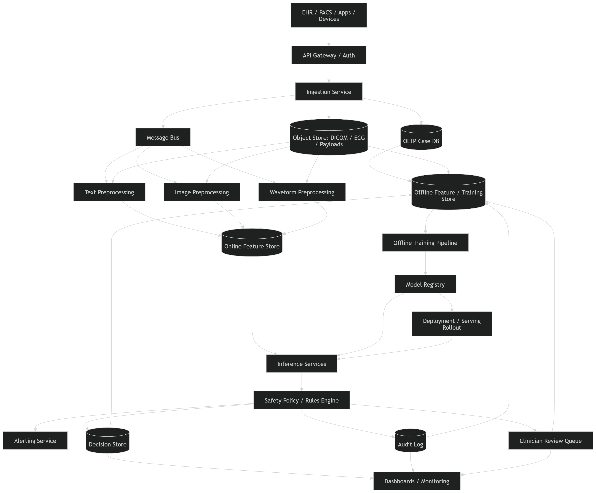

# Content Moderation for Medical Diagnosis

## 1. Problem Framing

We are designing a **production-grade medical diagnosis moderation platform**.

The goal is **not** to make the final medical decision autonomously for the patient. The goal is to:

* analyze medical content and signals,
* classify risk/severity/urgency,
* detect unsafe or low-confidence cases,
* route cases for escalation,
* support clinicians with decision assistance,
* enforce safety guardrails, auditability, fairness, and compliance.

This is closer to a **clinical decision support + triage moderation system** than a consumer chatbot.

Examples:

* radiology image triage for urgent findings,
* pathology slide pre-screening,
* ECG abnormality detection,
* symptom-text intake classification,
* lab-result risk flagging,
* multi-modal case prioritization in hospital workflows.

Because this is **high stakes**, the system should optimize for:

* **patient safety first**,
* **high recall on critical conditions**,
* **calibrated probabilities**,
* **human-in-the-loop review**,
* **traceability and compliance**.

---

## 2. Scope

### In Scope

* ingest medical content from multiple sources,
* perform preprocessing and validation,
* run ML models for diagnosis/risk classification,
* estimate uncertainty,
* trigger escalation workflows,
* provide clinician-facing explanations,
* log decisions for audit and monitoring,
* support continuous retraining and deployment.

### Out of Scope

* robotic treatment execution,
* fully autonomous diagnosis without clinician oversight,
* hospital billing workflows,
* full EHR implementation,
* drug prescription generation.

---

## 3. Example Use Cases

### Primary Use Cases

1. **Chest X-ray triage**

   * detect pneumothorax, pleural effusion, pneumonia, edema.
   * urgent cases moved to top of radiologist queue.

2. **ECG abnormality detection**

   * detect arrhythmia, ST elevation, bradycardia, tachycardia.
   * critical findings trigger immediate alert.

3. **Lab-result moderation**

   * flag dangerous values such as severe hyperkalemia, sepsis indicators, renal failure trends.

4. **Symptom text intake classification**

   * classify free-text complaints into emergency, urgent, routine, or self-care buckets.

5. **Pathology / dermatology image review assist**

   * prioritize suspicious malignancy cases for expert review.

### Why this is “content moderation”

Here, “content moderation” means deciding whether a medical content item is:

* safe to auto-pass into workflow,
* low-confidence and should be held,
* high-risk and must be escalated,
* corrupted/incomplete and should be rejected,
* out-of-distribution and should be routed to fallback review.

---

## 4. Functional Requirements

### Core Functional Requirements

1. Accept inputs from multiple modalities:

   * text,
   * images,
   * time series,
   * structured labs / vitals,
   * metadata.

2. Validate inputs:

   * schema validation,
   * modality compatibility,
   * corruption checks,
   * missing field detection,
   * patient / study ID consistency.

3. Preprocess data per modality.

4. Run model inference to produce:

   * predicted diagnosis or label,
   * severity class,
   * urgency score,
   * confidence score,
   * uncertainty estimate,
   * explanation artifacts.

5. Support binary, multiclass, multilabel, and ranking outputs.

6. Apply business rules / safety rules:

   * threshold policies,
   * critical condition overrides,
   * minimum confidence requirements,
   * demographic / site-specific routing.

7. Support **human-in-the-loop** review:

   * radiologist/clinician queue,
   * reviewer feedback,
   * disagreement workflows,
   * override logging.

8. Generate alerts for critical findings.

9. Provide audit trail:

   * input version,
   * model version,
   * preprocessing version,
   * thresholds applied,
   * final action taken,
   * reviewer action.

10. Support monitoring dashboards:

* latency,
* drift,
* calibration,
* false negatives,
* queue buildup,
* escalation rates.

11. Support model retraining pipeline from reviewed labels.

### Admin / Platform Functional Requirements

* manage model versions,
* configure thresholds by site or use case,
* shadow deploy new models,
* rollback quickly,
* view per-class metrics,
* export audit logs,
* manage access control.

---

## 5. Non-Functional Requirements

### Safety

* extremely low false negative rate for critical conditions,
* mandatory escalation on low confidence for severe cases,
* fail-safe behavior under missing inputs or system degradation.

### Availability

* 99.9%+ for online triage APIs,
* graceful degradation to manual review if models are unavailable.

### Latency

Depends on workflow.

* **Real-time symptom triage API**: p95 < 300 ms
* **ECG streaming alerting**: p95 < 1–2 sec
* **Radiology prioritization**: p95 < 5 sec acceptable
* **Batch pathology queue scoring**: minutes acceptable

### Scalability

* support hospital network / national scale,
* horizontal scaling for inference workers,
* burst tolerance during peak intake periods.

### Reliability

* no silent drops,
* exactly-once or idempotent processing for case records,
* durable logging,
* retry with deduplication.

### Explainability

* provide interpretable reasons or evidence,
* support saliency maps / feature contribution / symptom evidence.

### Compliance and Privacy

* HIPAA-style controls,
* encryption in transit and at rest,
* PHI redaction where possible,
* strict access control,
* auditable access logs,
* retention and deletion policies.

### Fairness

* monitor subgroup performance across age, sex, race proxies where legally/ethically appropriate,
* detect calibration gaps,
* prevent systematic underdiagnosis.

### Observability

* model monitoring,
* data quality monitoring,
* infra monitoring,
* decision auditability.

---

## 6. Success Metrics

In this domain, accuracy alone is weak. The system should optimize by task.

### Primary ML Metrics

1. **Recall / Sensitivity** for critical conditions

   * most important when missing a condition is dangerous.
   * e.g. pneumothorax, stroke, STEMI, sepsis.

2. **Precision**

   * important because too many false alarms create alert fatigue.

3. **PR-AUC**

   * better than ROC-AUC for rare disease settings.

4. **Specificity**

   * useful when false positives are costly.

5. **F1 / F-beta**

   * choose beta > 1 when recall matters more.

6. **Calibration metrics**

   * Brier score,
   * Expected Calibration Error,
   * reliability curves.

7. **False Negative Rate for critical classes**

   * executive-level safety metric.

8. **Top-k recall**

   * useful for diagnostic candidate ranking.

9. **OOD detection quality**

   * AUROC / AUPRC for in-distribution vs out-of-distribution separation.

### Operational Metrics

* p50/p95/p99 inference latency,
* throughput per modality,
* alert generation delay,
* escalation rate,
* manual review turnaround time,
* queue backlog size,
* retry rate,
* failed ingestion rate,
* model unavailability rate.

### Clinical / Business Metrics

* reduction in time-to-review for critical cases,
* reduction in missed urgent cases,
* radiologist workload saved,
* clinician override rate,
* patient outcome lift where measurable,
* cost per reviewed case.

---

## 7. Metric Prioritization by Use Case

### A. Critical Emergency Detection

Examples: stroke, sepsis, pneumothorax, STEMI.

Optimize for:

* Recall,
* False Negative Rate,
* calibration,
* latency.

Tradeoff:

* allow lower precision if human review can absorb extra alerts.

### B. Routine Screening

Examples: diabetic retinopathy screening, skin lesion pre-screen.

Optimize for:

* Recall first,
* then precision,
* PR-AUC,
* subgroup fairness.

### C. Worklist Prioritization

Examples: radiology queue ranking.

Optimize for:

* ranking quality,
* top-k recall,
* NDCG / precision at k,
* latency.

### D. Symptom Triage Chat / Intake

Optimize for:

* recall of urgent cases,
* robust OOD detection,
* toxicity / ambiguity detection,
* multilingual robustness.

---

## 8. Back-of-the-Envelope Estimation

Let us pick a medium-large hospital network.

### Example Volume Assumptions

* 50 hospitals
* each hospital produces per day:

  * 20,000 symptom text submissions
  * 8,000 lab-result events
  * 2,000 imaging studies
  * 1,000 ECG traces

### Daily Volume

* symptom text: 50 × 20,000 = **1,000,000/day**
* lab events: 50 × 8,000 = **400,000/day**
* imaging studies: 50 × 2,000 = **100,000/day**
* ECG traces: 50 × 1,000 = **50,000/day**

Total = **1.55M items/day**

### QPS Estimate

1.55M / 86,400 ≈ **18 QPS average**

Peak traffic can be 5–10x.
Design for:

* **180 QPS peak aggregate**

### Storage Estimate

Assume:

* text case + metadata = 20 KB average
* lab case = 10 KB
* ECG compressed = 200 KB
* image metadata only in serving DB, raw image in blob storage = 500 KB index record + external object link

Rough daily storage:

* text: 1,000,000 × 20 KB = 20 GB/day
* labs: 400,000 × 10 KB = 4 GB/day
* ECG: 50,000 × 200 KB = 10 GB/day
* image records + artifacts ≈ 50 GB/day logical including embeddings/explanations/heatmaps metadata references

Total metadata + artifacts ≈ **84 GB/day**
Raw medical images in object store may dominate, easily **TBs/day** depending on modality.

### Inference Capacity

Suppose:

* text model: 50 ms per request on CPU/GPU mixed fleet
* imaging model: 300 ms per image on GPU
* ECG model: 150 ms per trace
* fusion/scoring overhead: 20 ms

At 180 QPS peak with mixed traffic, use:

* autoscaled CPU pool for text/rules,
* GPU pool for image / waveform models,
* async queues for non-interactive workloads.

---

## 9. High-Level Architecture

## 9.1 Main Components

1. **Data Sources**

   * EHR,
   * PACS,
   * lab systems,
   * ECG devices,
   * mobile intake apps,
   * clinician portals.

2. **API Gateway / Ingestion Layer**

   * authentication,
   * request validation,
   * rate limiting,
   * idempotency keys.

3. **Ingestion Service**

   * accepts case payload,
   * normalizes format,
   * writes metadata record,
   * publishes event.

4. **Message Bus / Queue**

   * decouples ingestion from inference,
   * handles retries,
   * supports priority queues.

5. **Preprocessing Service**

   * modality-specific cleaning,
   * feature extraction,
   * de-identification,
   * data quality scoring.

6. **Feature Store / Case Feature DB**

   * online features for real-time inference,
   * offline features for retraining.

7. **Model Inference Service**

   * text classifier,
   * image classifier,
   * ECG / time-series model,
   * multimodal fusion model,
   * uncertainty estimator.

8. **Rules and Safety Policy Engine**

   * thresholding,
   * escalation rules,
   * critical-class overrides,
   * OOD fallback,
   * human review routing.

9. **Decision Store**

   * predicted labels,
   * confidence,
   * explanations,
   * versioning.

10. **Clinician Review System**

* review queues,
* annotation UI,
* override / approve / reject actions.

11. **Alerting Service**

* pager, EHR alert, email/SMS/internal messaging depending on policy.

12. **Monitoring + Audit Platform**

* metrics, logs, traces,
* model drift,
* fairness and calibration dashboards,
* audit reports.

13. **Training Pipeline**

* label ingestion,
* data curation,
* retraining,
* evaluation,
* shadow deployment.

---

## 10. End-to-End Flow

### Online Flow

1. A case arrives from EHR/PACS/app.
2. API gateway authenticates and validates the request.
3. Ingestion service creates a `case_id` and stores raw metadata.
4. Event is pushed to queue.
5. Preprocessing service fetches raw payload / objects.
6. Preprocessing generates normalized features and quality checks.
7. If payload is corrupted or incomplete, case is marked **REJECT / MANUAL REVIEW**.
8. Inference service produces:

   * diagnosis probabilities,
   * severity,
   * confidence,
   * uncertainty,
   * explanation.
9. Safety policy engine applies rules.
10. Final action becomes one of:

* pass to workflow,
* urgent escalation,
* manual review,
* reject,
* abstain.

11. Decision is logged in immutable audit store.
12. If required, alert is sent and case appears in clinician queue.
13. Reviewer action becomes training feedback later.

### Offline Training Flow

1. Collect reviewed / finalized labels.
2. Curate and de-identify data.
3. Build train/validation/test splits by patient/site/time.
4. Train candidate models.
5. Evaluate on safety, fairness, and calibration gates.
6. Shadow deploy.
7. Compare online performance against incumbent model.
8. Promote if safe.

---

## 11. Data Model / Core Entities

### `Case`

* case_id
* patient_id_hash
* source_system
* modality
* hospital_id
* encounter_id
* created_at
* received_at
* status
* priority
* raw_object_uri
* schema_version

### `PreprocessingResult`

* case_id
* preprocessing_version
* quality_score
* missing_fields
* normalized_features_uri
* deidentification_status
* ood_input_flags
* created_at

### `ModelPrediction`

* prediction_id
* case_id
* model_name
* model_version
* label_scores
* predicted_labels
* confidence
* uncertainty_score
* calibration_bucket
* explanation_uri
* inference_latency_ms
* created_at

### `Decision`

* decision_id
* case_id
* final_action
* urgency_level
* escalation_reason
* threshold_policy_version
* reviewer_required
* created_at

### `Review`

* review_id
* case_id
* reviewer_id
* reviewer_role
* final_label
* override_reason
* reviewed_at

### `Alert`

* alert_id
* case_id
* severity
* destination
* ack_status
* created_at

---

## 12. Low-Level Design

## 12.1 API Design

### `POST /cases`

Create a new medical moderation case.

Request:

* patient/study metadata,
* modality,
* object URIs or payload,
* source context,
* idempotency key.

Response:

* case_id,
* accepted status,
* tracking info.

### `GET /cases/{case_id}`

Return case state and audit summary.

### `GET /cases/{case_id}/prediction`

Return latest model prediction.

### `GET /cases/{case_id}/decision`

Return moderation decision.

### `POST /reviews/{case_id}`

Submit clinician review / override.

### `POST /threshold-policies`

Update risk thresholds with approval workflow.

### `GET /metrics`

Expose operational counters.

---

## 12.2 Preprocessing Pipeline by Modality

### Text Intake

* language detection,
* spelling normalization,
* abbreviation expansion,
* negation detection,
* entity extraction,
* PHI handling,
* tokenization / embedding generation.

### Medical Images

* DICOM parsing,
* orientation normalization,
* pixel intensity normalization,
* resizing / cropping,
* study-level aggregation,
* image quality checks,
* duplicate detection.

### ECG / Waveforms

* resampling,
* denoising,
* baseline wander removal,
* lead validation,
* segmentation,
* feature extraction or raw tensor packaging.

### Labs / Structured Data

* unit normalization,
* outlier sanity checks,
* missingness indicators,
* temporal aggregation,
* trend derivation.

---

## 12.3 Model Layer

### Possible Model Breakdown

1. **Text triage classifier**

   * transformer-based encoder,
   * multilabel outputs,
   * urgency head.

2. **Image diagnosis model**

   * CNN / ViT-based encoder,
   * study-level aggregator,
   * heatmap output.

3. **ECG / time-series model**

   * 1D CNN / transformer / hybrid.

4. **Structured-data risk model**

   * gradient boosted trees or neural net depending feature volume.

5. **Multimodal fusion model**

   * combines image/text/labs/vitals.

6. **Uncertainty / abstention module**

   * ensemble variance,
   * Monte Carlo dropout,
   * conformal prediction,
   * energy-based OOD score.

### Why uncertainty is mandatory

In medical diagnosis, the model must be able to say:

* “I do not know”,
* “input differs from training distribution”,
* “confidence too low for automated routing”.

This is a core safety feature, not a nice-to-have.

---

## 12.4 Decision Policy Engine

The policy engine sits after inference.

Inputs:

* model probabilities,
* uncertainty score,
* case metadata,
* hospital/site policy,
* business rules,
* reviewer availability.

Example rules:

* if `p(stroke) > 0.35`, escalate immediately.
* if `uncertainty > 0.6`, route to manual review.
* if image quality score < threshold, reject and request reacquisition.
* if critical lab value exceeds hard medical threshold, alert regardless of model confidence.
* if model and rules disagree, choose safer action.

This layer is essential because **not everything should be learned purely by ML**.

---

## 12.5 Human Review Queue Design

Use priority queues.

Queue dimensions:

* urgency,
* modality,
* specialty,
* hospital/site,
* SLA timer,
* model uncertainty.

Examples:

* red queue: immediate review < 5 min,
* amber queue: review < 30 min,
* routine queue: review < 4 hr.

Reviewer actions:

* approve,
* override diagnosis,
* request more data,
* mark invalid,
* escalate to specialist.

Need:

* optimistic locking on assignments,
* audit logs on every action,
* secondary reviewer flow for disagreements.

---

## 12.6 Storage Choices

### Object Store

Use for:

* DICOM files,
* images,
* waveforms,
* saliency maps,
* large explanation artifacts.

### OLTP Database

Use for:

* case metadata,
* decision records,
* queue state,
* alert status,
* review records.

A relational DB is a better fit here because:

* strict consistency matters,
* auditing is important,
* joins across cases/reviews/alerts are common.

### Feature Store

Use for:

* reusable online features,
* training/serving consistency,
* point-in-time correct offline features.

### Data Lake / Warehouse

Use for:

* offline analytics,
* retraining datasets,
* monitoring aggregates,
* fairness analysis.

---

## 13. Candidate HLD Diagram (Textual)

---

## 14. Data Preprocessing Strategy

This part matters a lot in interview rounds because many ML system design answers are too model-centric and ignore data.

### 14.1 Dataset Construction

* collect cases from multiple hospitals,
* ensure representative class distribution,
* capture hard negatives,
* include ambiguous cases,
* include device/site variability,
* include demographic diversity.

### 14.2 Label Quality

* labels should come from clinician-reviewed outcomes where possible,
* support adjudication for disagreements,
* use weak labels cautiously,
* store label provenance.

### 14.3 Data Cleaning

* remove corrupt files,
* standardize measurement units,
* deduplicate repeat studies,
* resolve timestamp inconsistencies,
* check impossible values.

### 14.4 Class Imbalance Handling

Critical because rare diseases are common in these tasks.

Methods:

* class-weighted loss,
* focal loss,
* oversampling rare positives,
* hard negative mining,
* threshold tuning by class,
* one-vs-rest heads for rare classes.

### 14.5 Split Strategy

Never do naive random splits only.

Use:

* patient-level split,
* site-level holdout,
* temporal holdout.

Why:

* avoid patient leakage,
* test generalization across hospitals,
* simulate deployment drift.

### 14.6 Augmentation

* image rotations / intensity jitter where clinically valid,
* waveform noise augmentation,
* text synonym augmentation very carefully.

Do **not** use augmentation that changes diagnosis semantics.

### 14.7 Calibration

After training, calibrate probabilities using:

* temperature scaling,
* isotonic regression,
* class-specific threshold tuning.

---

## 15. Training Pipeline Design

### Pipeline Stages

1. data extraction,
2. de-identification,
3. feature generation,
4. train/val/test split,
5. model training,
6. evaluation,
7. calibration,
8. fairness checks,
9. explainability checks,
10. packaging,
11. registry registration,
12. deployment.

### Evaluation Gates Before Promotion

A model cannot ship unless:

* recall for critical classes exceeds threshold,
* calibration is within range,
* subgroup gap is acceptable,
* latency fits SLO,
* no regression on held-out sites,
* shadow-mode disagreement is reviewed.

---

## 16. Deployment Strategy

## 16.1 Serving Architecture

Separate services by workload.

### Online Synchronous Path

For:

* symptom intake,
* urgent labs,
* ECG alerts.

Requirements:

* low latency,
* autoscaling,
* circuit breakers,
* fast fallback.

### Async / Batch Path

For:

* pathology,
* bulk imaging reprioritization,
* overnight rescoring.

Requirements:

* queue-driven workers,
* GPU scheduling,
* job retries.

## 16.2 Multi-Stage Rollout

1. offline validation,
2. shadow deployment,
3. silent compare against production,
4. canary rollout,
5. progressive traffic ramp,
6. full rollout.

## 16.3 Safe Deployment Rules

* instant rollback support,
* versioned preprocessing + model + thresholds,
* no unreviewed threshold changes,
* dual writing of prediction logs during rollout,
* special watch on critical-class false negatives.

---

## 17. Scaling Strategy

### Horizontal Scaling

* stateless API gateways,
* stateless ingestion workers,
* autoscaled inference replicas,
* GPU node pools for heavy models.

### Queue Partitioning

Partition by:

* modality,
* hospital/site,
* urgency.

This avoids one heavy modality from starving others.

### Priority Scheduling

Critical cases preempt routine workload.

### Caching

Useful for:

* repeated metadata lookups,
* model artifacts,
* threshold configs,
* patient-independent reference data.

Do **not** rely on caching for mutable clinical decisions without careful consistency guarantees.

### Storage Tiering

* hot OLTP data for recent cases,
* warm analytical store for weeks/months,
* cold object storage for long-term retention.

---

## 18. Reliability and Failure Handling

### Failure Scenarios

1. Model service timeout

   * fallback to manual review.

2. Object store unavailable

   * retry with exponential backoff,
   * hold case in pending queue.

3. Corrupt DICOM / malformed ECG

   * reject with explicit reason,
   * request reacquisition.

4. Queue backlog spike

   * autoscale workers,
   * degrade routine processing first,
   * protect urgent queue.

5. Drift detected

   * increase abstention,
   * tighten auto-pass thresholds,
   * route more cases to manual review.

6. Database failover

   * use managed multi-AZ relational DB,
   * durable write-ahead logging,
   * tested failover procedures.

### Idempotency

Every case submission should use:

* case source ID,
* idempotency key,
* dedupe logic.

This matters because hospitals often retry requests.

---

## 19. Monitoring and Observability

## 19.1 Infra Monitoring

* CPU/GPU utilization,
* memory,
* queue lag,
* request rates,
* latency,
* errors.

## 19.2 Data Quality Monitoring

* missing field rate,
* corruption rate,
* modality mismatch,
* image quality distribution,
* lab unit inconsistencies,
* OOD rate.

## 19.3 Model Monitoring

* class probability drift,
* feature drift,
* embedding drift,
* calibration drift,
* false negative trends,
* site-wise performance,
* subgroup performance.

## 19.4 Human Workflow Monitoring

* review SLA adherence,
* reviewer load,
* override rate,
* disagreement rate,
* alert fatigue indicators.

---

## 20. Security / Privacy / Compliance Design

### Security Controls

* mutual TLS between services,
* RBAC / ABAC,
* audit all access,
* row-level access restrictions,
* secrets management,
* HSM/KMS-backed encryption.

### Privacy Controls

* de-identify training data,
* minimize PHI in logs,
* tokenize patient identifiers,
* support retention and deletion workflows.

### Compliance-Oriented Design

* immutable audit trails,
* model decision reproducibility,
* access review,
* data lineage,
* documented validation reports,
* change management for thresholds/models.

---

## 21. Fairness, Bias, and Safety Risks

Medical ML systems fail badly when they are trained on narrow populations.

### Risks

* underperformance on rare demographics,
* scanner/device-specific bias,
* site-specific shortcuts,
* label bias from historical practice,
* overconfidence on unfamiliar data.

### Mitigations

* subgroup evaluation,
* site holdout testing,
* calibration by subgroup,
* uncertainty-aware abstention,
* periodic revalidation,
* clinician override analysis,
* explicit safety committee review.

---

## 22. Tradeoffs

### High Recall vs Alert Fatigue

* higher recall catches more dangerous cases,
* but lower precision overloads clinicians.

### End-to-End Model vs Modular Pipeline

* end-to-end models may improve raw performance,
* modular systems are easier to validate, explain, and operate.

### Aggressive Automation vs Manual Review

* automation improves cost and speed,
* manual review improves safety but limits scale.

### Single Global Model vs Per-Site Models

* global model is simpler,
* per-site adaptation may improve performance but adds maintenance.

### Synchronous Inference vs Async Queue

* sync is faster for user-facing triage,
* async is more robust for heavy workloads.

---

## 23. Interview Discussion Points

If the interviewer pushes deeper, focus on these.

### A. Why accuracy is not enough

Because disease prevalence is low and false negatives are dangerous. Use recall, PR-AUC, calibration, and class-specific thresholds.

### B. Why human-in-the-loop is mandatory

Because uncertainty, rare conditions, and OOD inputs make full automation unsafe.

### C. Why calibration matters

A 0.9 probability must mean something trustworthy if clinicians use it to prioritize work.

### D. Why split strategy matters

Random split leakage can make a medical model look great and fail in production.

### E. Why policy engine exists outside ML

Some rules are deterministic and safety-critical, like hard lab thresholds or mandatory escalation paths.

---

## 24. Example Answer Structure for an Interview

When speaking, you can present it in this order:

1. Clarify use case and modality.
2. State that this is high-stakes and human-in-the-loop.
3. Define core metrics: recall for critical findings, calibration, latency.
4. Outline ingestion → preprocessing → inference → policy engine → review queue.
5. Explain data design and leakage prevention.
6. Discuss thresholds, abstention, and OOD detection.
7. Cover storage, scaling, and failure handling.
8. Finish with monitoring, fairness, and safe deployment.

That sequence is usually much stronger than jumping straight into model architecture.

---

## 25. Final Production-Ready Design Summary

A strong production medical diagnosis moderation system should:

* ingest multimodal medical content reliably,
* preprocess and validate aggressively,
* use specialized models per modality,
* estimate uncertainty and support abstention,
* apply deterministic safety rules after ML inference,
* route risky or ambiguous cases to clinicians,
* optimize recall for critical diagnoses,
* maintain calibration and fairness,
* support full auditability and compliance,
* continuously monitor drift and retrain safely.

The most important design principle is simple:

**In medical diagnosis, the system should optimize for safe decision support, not blind automation.**

---

## 26. Compact Cheat Sheet

### Best Metrics

* critical diagnosis: Recall, FNR, PR-AUC, calibration
* screening: Recall, Precision, subgroup fairness
* prioritization: top-k recall, NDCG
* clinician trust: calibration, override rate

### Core Components

* ingestion
* preprocessing
* model inference
* uncertainty/OOD
* rules engine
* review queue
* alerts
* audit + monitoring
* retraining pipeline

### Must-Have Safety Features

* abstention
* human review
* critical override rules
* model/version lineage
* drift monitoring
* rollback

### Common Failure Modes

* false negatives on rare classes
* leakage in train/test split
* calibration failure
* hospital/site drift
* alert fatigue
* silent pipeline drops
