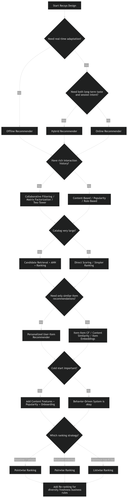

# RecSys Design Decision Tree



## 1. First question: **Do recommendations need to react in real time?**

```text
Need strong session awareness / latest actions matter?
├── Yes → Online or Hybrid
└── No  → Offline is enough
```

### Use **Offline**

When:

* recommendations can be refreshed hourly/daily
* product is stable
* latency/cost simplicity matters more than freshness

Examples:

* homepage rows
* daily email recommendations
* weekly playlist suggestions

### Use **Online**

When:

* user intent changes within session
* latest click/watch/skip must affect output quickly

Examples:

* reels feed
* short video feed
* “up next”

### Use **Hybrid**

When:

* you need both stable long-term taste and short-term adaptation

Examples:

* Spotify home
* Netflix homepage with live continuation
* Instagram/Reels style feeds

---

## 2. Second question: **Do you have rich historical interaction data?**

```text
Do you have enough user-item interaction history?
├── Yes → behavior-based methods become strong
└── No  → rely more on content / popularity / rules
```

### If **Yes**

You can use:

* collaborative filtering
* matrix factorization
* two-tower retrieval
* learned ranking

### If **No**

You should prefer:

* content-based filtering
* metadata embeddings
* popularity-based recommendations
* onboarding + heuristic systems

---

## 3. Third question: **Do items have strong metadata/content features?**

```text
Do items have useful text / image / tags / metadata?
├── Yes → Content-based or embedding-based methods are viable
└── No  → Depend more on collaborative signals
```

### If **Yes**

Use:

* classic content-based filtering
* embedding-based item retrieval
* hybrid with content + behavior

### If **No**

Use:

* collaborative filtering
* matrix factorization
* interaction-driven two-tower with IDs/signals

---

## 4. Fourth question: **Do you have cold start problems?**

```text
Many new users or new items?
├── Yes → need content / popularity / onboarding / hybrid
└── No  → pure collaborative methods may work fine
```

### New users

Use:

* trending/popular fallback
* onboarding preferences
* contextual priors
* session-based modeling after first actions

### New items

Use:

* content embeddings
* metadata similarity
* exploration buckets
* freshness boosts

---

## 5. Fifth question: **How large is the item catalog?**

```text
Item catalog size?
├── Small / medium → exact scoring may be okay
└── Large (100K+) → retrieval stage becomes necessary
```

### Small to medium

Possible:

* direct scoring
* pointwise ranker over all items
* simpler architecture

### Large catalog

Need:

* candidate generation
* two-tower retrieval
* ANN / vector search
* multi-stage ranking

This is where:

```text
Retrieval → Ranking → Re-ranking
```

becomes mandatory.

---

## 6. Sixth question: **Do you need only similar-item recommendations, or personalized recommendations?**

```text
Need item-to-item similarity only?
├── Yes → item-based / content-based / item embedding retrieval
└── No  → full user-personalized system
```

### Similar-item only

Use:

* item-item collaborative filtering
* item embeddings
* content similarity
* “because you watched X”

### Personalized

Use:

* user modeling
* collaborative filtering
* two-tower
* ranking model

---

## 7. Seventh question: **Is retrieval the bottleneck or ranking the bottleneck?**

```text
Can you afford to score all items?
├── Yes → simpler ranking architecture
└── No  → build retrieval first
```

### If you cannot score all items

Use:

* two-tower retrieval
* ANN
* candidate pools
* then rank top few hundred/thousand

### If you can

Use:

* direct pointwise ranking
* pairwise/listwise ranking over small candidate set

---

## 8. Eighth question: **What stage are you optimizing?**

```text
Problem stage?
├── Candidate generation → optimize recall
├── Ranking             → optimize ordering
└── Final feed shaping  → optimize diversity/freshness/business goals
```

### Candidate generation

Use:

* collaborative filtering
* two-tower
* ANN
* graph retrieval
* popularity retrieval

Metric:

* Recall@K

### Ranking

Use:

* pointwise ranking
* pairwise ranking
* listwise ranking

Metric:

* NDCG, CTR, watch time

### Re-ranking

Use:

* business rules
* diversity constraints
* freshness boosts
* creator balancing

Metric:

* diversity, novelty, coverage, retention

---

## 9. Ninth question: **What kind of labels do you have?**

```text
Feedback type?
├── Explicit ratings → rating prediction / CF works well
└── Implicit signals → ranking + negative sampling
```

### Explicit feedback

Use:

* classic collaborative filtering
* matrix factorization
* regression-style ranking

### Implicit feedback

Use:

* pointwise CTR prediction
* pairwise ranking
* BPR
* listwise ranking
* two-tower with sampled negatives

Most real systems are here.

---

## 10. Tenth question: **Do you need explainability?**

```text
Need easy explanations?
├── Yes → favor content/item-based/simple hybrids
└── No  → deeper retrieval + ranking is okay
```

### If yes

Prefer:

* content-based
* item-item similarity
* popularity by category
* simple weighted hybrids

Because you can say:

* because you watched X
* similar to Y
* popular in your region

---

# Final condensed cheat sheet

```text
Start
│
├── Need real-time adaptation?
│   ├── No  → Offline
│   └── Yes
│       ├── Only fresh/session-driven? → Online
│       └── Need stable + fresh?       → Hybrid
│
├── Have strong interaction history?
│   ├── Yes → Collaborative / Two-Tower / Ranking
│   └── No  → Content-Based / Popularity / Rules
│
├── Have rich item metadata?
│   ├── Yes → Content-Based / Embedding-Based / Hybrid
│   └── No  → Collaborative methods matter more
│
├── Big catalog?
│   ├── No  → direct ranking may work
│   └── Yes → Retrieval + ANN + Ranking
│
├── Cold start important?
│   ├── Yes → Content + Popularity + Onboarding + Hybrid
│   └── No  → Pure collaborative methods possible
│
├── Need similar items only?
│   ├── Yes → Item-item / content similarity
│   └── No  → full personalized recsys
│
└── Ranking stage?
    ├── Simple baseline → Pointwise
    ├── Relative order  → Pairwise
    └── Best top-K      → Listwise
```

---

# Quick mapping table

| Situation                    | Best starting choice         |
| ---------------------------- | ---------------------------- |
| Small app, little data       | Popularity + content-based   |
| Lots of user-item history    | Collaborative filtering / MF |
| Huge catalog                 | Two-tower + ANN              |
| Fresh session intent matters | Online ranking               |
| Need both long-term + fresh  | Hybrid                       |
| New items appear often       | Content embeddings           |
| Need easy explanations       | Item-based / content-based   |
| Need production-grade feed   | Hybrid multi-stage pipeline  |

---

# One practical rule

If you are unsure in an interview, default to:

```text
Hybrid = safest real-world answer
Offline = simplest cheap answer
Online = freshest but most complex answer
```

---
