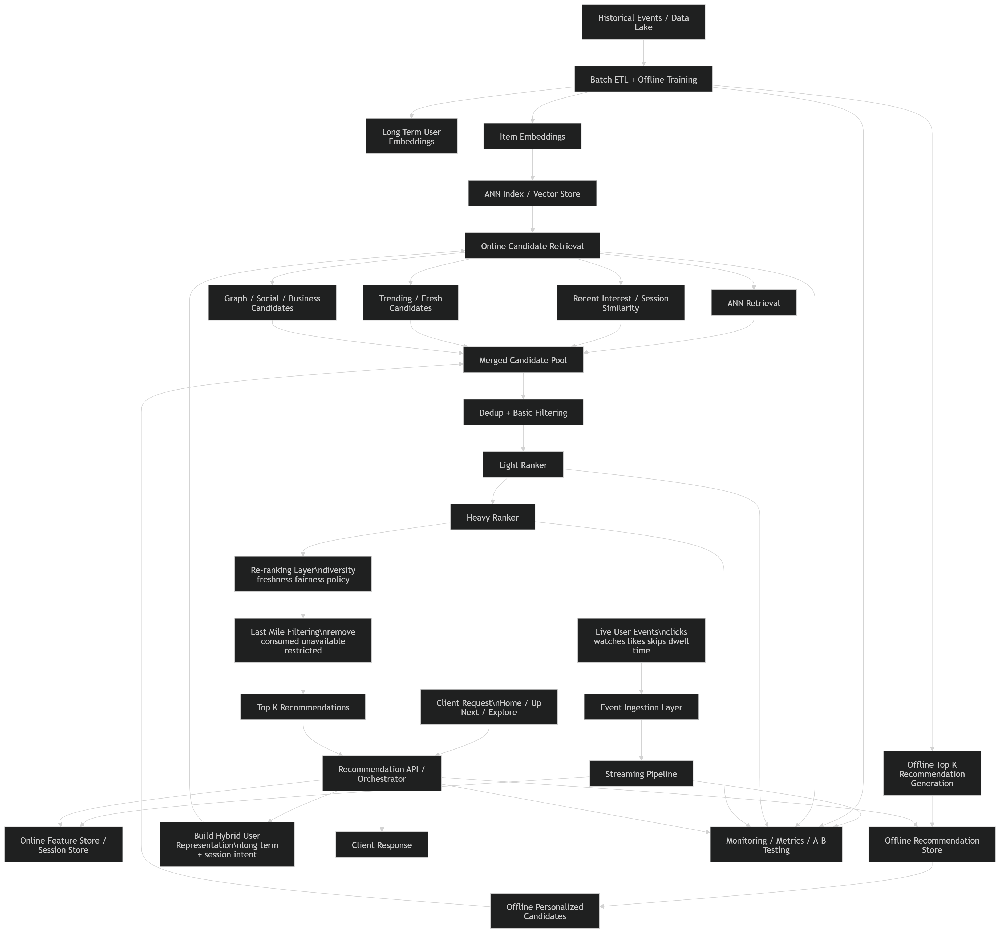

# Hybrid Recommendation System Design

## 1. Problem Statement

Design a **hybrid recommendation system** for a content platform that combines:

* **offline recommendation generation** for long-term user preference modeling
* **online recommendation generation** for session-aware and real-time personalization

The system should:

* leverage large-scale historical data offline
* react to recent actions online
* serve recommendations with low latency
* scale to millions of users and items
* degrade gracefully if online systems fail

This is the architecture typically used by:

* video platforms
* music apps
* social feeds
* e-commerce homepages

---

# 2. Functional Requirements

## 2.1 Core Functional Requirements

1. The system shall ingest:

   * historical user-item interactions
   * real-time user events
   * item metadata
   * optional social / graph signals

2. The system shall generate personalized recommendations for:

   * homepage
   * up-next / next-best-item
   * similar item surfaces
   * explore/discovery surfaces

3. The system shall support:

   * offline batch recommendation generation
   * online request-time recommendation refresh

4. The system shall combine:

   * long-term preferences
   * short-term session intent
   * freshness/trending signals

5. The system shall retrieve candidates efficiently from a large item catalog.

6. The system shall rank candidates using user, item, and contextual features.

7. The system shall exclude:

   * consumed items
   * unavailable items
   * restricted items
   * blocked categories or creators

8. The system shall support fallback modes when:

   * online ranker fails
   * feature store is unavailable
   * ANN retrieval fails
   * fresh features are delayed

---

## 2.2 Optional Functional Requirements

1. Support recommendation explanations:

   * because you watched X
   * popular in your region
   * similar to your recent interests

2. Support exploration:

   * fresh items
   * underexposed items
   * new creators

3. Support business constraints:

   * diversity
   * monetization
   * fairness
   * ad spacing

4. Support A/B testing and model version rollout.

---

# 3. Non-Functional Requirements

## 3.1 Latency

* recommendation serving should ideally stay under **150–250 ms P99**
* online augmentation should fit strict request budgets

## 3.2 Scalability

* support millions of users
* support millions of items
* support high QPS at peak

## 3.3 Freshness

* recent user actions should affect recommendations quickly
* new items should become discoverable quickly

## 3.4 Availability

* if online path fails, offline recommendations should still be servable

## 3.5 Reliability

* no empty feed
* stale but safe results are acceptable as fallback

## 3.6 Maintainability

* clear separation between:

  * batch training
  * streaming feature updates
  * retrieval
  * ranking
  * serving

## 3.7 Observability

* monitor latency per stage
* monitor quality metrics
* monitor freshness lag
* monitor fallback rate

---

# 4. Back-of-the-Envelope Estimation

Let’s assume:

* total users = **50M**
* daily active users = **10M**
* total items = **20M**
* avg rec requests per DAU per day = **15**
* peak QPS = **15K–20K**
* daily events per DAU = **40**
* store offline top 200 recommendations per user

---

## 4.1 Event Volume

Daily events:

[
10M \times 40 = 400M \text{ events/day}
]

If each event is ~200 bytes:

[
400M \times 200 = 80GB/day
]

This is fine for Kafka / PubSub class systems.

---

## 4.2 Offline Recommendation Storage

Store 200 recommendations for all 50M users:

[
50M \times 200 = 10B \text{ recommendation entries}
]

Assume ~20 bytes effective storage per entry after compact representation:

[
10B \times 20 = 200GB
]

With replication and overhead, real storage could be **400GB+** depending on DB choice.

This is large but practical in distributed KV systems.

---

## 4.3 Serving Traffic

Daily requests:

[
10M \times 15 = 150M \text{ requests/day}
]

Average QPS:

[
150M / 86400 \approx 1736
]

Peak 10x:

[
~15K - 20K \text{ QPS}
]

So serving infra should comfortably support tens of thousands of QPS.

---

## 4.4 Candidate Retrieval Cost

Suppose online pipeline retrieves:

* 400 offline candidates
* 400 ANN online candidates
* 200 popular/fresh candidates

Union gives around:

* 700–1000 unique candidates/request

If heavy ranker scores 200 items after light filtering:

[
20K \times 200 = 4M \text{ heavy scores/sec at peak}
]

This is substantial, so staged ranking is necessary.

---

## 4.5 Item Embedding Storage

Assume:

* 20M items
* 128-d embeddings
* float32

[
20M \times 128 \times 4 \approx 10.24GB
]

With ANN index overhead, maybe **20–40GB+** total. Easy to shard in memory.

---

# 5. High-Level Design



## 5.1 Design Philosophy

The hybrid system should combine:

### Offline path

Used for:

* heavy model training
* long-term user preference estimation
* precomputed recommendation lists
* item embeddings
* stable popularity/cohort signals

### Online path

Used for:

* session updates
* recent clicks/watches/skips
* request-time candidate retrieval
* ranking and re-ranking
* freshness and exploration

---

## 5.2 Core Components

1. **Event Ingestion Layer**

   * user interactions, content events

2. **Raw Event Log / Data Lake**

   * immutable historical logs

3. **Streaming Pipeline**

   * updates online/session features

4. **Offline ETL + Batch Pipeline**

   * aggregates historical data
   * trains models
   * computes offline recommendations

5. **Offline Feature Store**

   * long-term user features
   * item embeddings
   * popularity/cohort stats

6. **Online Feature Store / Session Store**

   * recent clicks
   * recent watches
   * session embedding
   * short-term counters

7. **Candidate Retrieval Service**

   * offline precomputed candidates
   * ANN retrieval
   * trending/fresh candidates
   * graph/social candidates

8. **Ranking Service**

   * light ranker + heavy ranker

9. **Re-ranking / Policy Layer**

   * diversity
   * freshness
   * fairness
   * suppression constraints

10. **Recommendation API / Feed Orchestrator**

* fetches candidate pools
* coordinates ranking
* returns final list

11. **Recommendation Store**

* stores offline top-K lists

12. **Monitoring / Experimentation Platform**

* online and offline metrics

---

# 6. High-Level Flow

## 6.1 Background Offline Flow

```text
Historical Events
    ↓
Data Lake / Warehouse
    ↓
Batch ETL
    ↓
Model Training
    ↓
Offline User Embeddings / Item Embeddings
    ↓
Precomputed Recommendation Lists
    ↓
Recommendation Store
```

---

## 6.2 Real-Time Online Flow

```text
Live User Events
    ↓
Stream Processing
    ↓
Online Feature Store / Session Store
```

---

## 6.3 Request-Time Flow

```text
User Request
    ↓
Recommendation API
    ↓
Fetch offline recs + online features
    ↓
Retrieve online candidates
    ↓
Merge candidate pools
    ↓
Light ranker
    ↓
Heavy ranker
    ↓
Re-ranking
    ↓
Return final feed
```

---

# 7. Functional Split: What Runs Offline vs Online

## 7.1 Offline Responsibilities

* long-term user embedding generation
* item embedding generation
* collaborative filtering / matrix factorization training
* precomputed homepage recommendation lists
* item-item similarity precomputation
* regional/category popularity tables

## 7.2 Online Responsibilities

* real-time session updates
* request-time user representation refinement
* live retrieval from ANN
* final ranking
* diversity and freshness control
* request-time filtering

This split is the entire point of hybrid design.

---

# 8. API Shape

### GET /recommendations?user_id=U123&surface=home

Response:

```json
{
  "user_id": "U123",
  "surface": "home",
  "served_at": "2026-03-23T21:30:00Z",
  "items": [
    {"item_id": "I101", "score": 0.96, "reason": "recent-interest"},
    {"item_id": "I552", "score": 0.94, "reason": "offline-personalized"}
  ]
}
```

---

# 9. Data Model

## 9.1 Event Table / Stream

* user_id
* item_id
* event_type
* timestamp
* dwell_time
* watch_time
* source_surface
* device
* region

## 9.2 Offline User Feature Table

* user_id
* long_term_embedding
* top categories
* avg watch time
* creator affinity
* cohort / segment

## 9.3 Online User Feature Table

* user_id
* recent_items
* recent_categories
* session_embedding
* recent_action_counts
* freshness timestamp

## 9.4 Item Feature Table

* item_id
* embedding
* metadata
* category
* quality score
* freshness score
* policy flags

## 9.5 Offline Recommendation Table

* user_id
* surface
* item_id
* rank
* score
* generated_at
* model_version

---

# 10. Low-Level Design: Recommendation Algorithm

The hybrid algorithm has multiple candidate sources, each serving a different purpose.

---

## 10.1 Candidate Sources

For each request, build candidates from:

### A. Offline Personalized Candidates

Precomputed top-N list from offline model

Examples:

* collaborative filtering output
* hybrid batch model output
* long-term embedding matches

Purpose:

* stable personalization
* low-latency fallback
* cheap base layer

---

### B. Online ANN Retrieval

Use current user embedding to retrieve nearest items from vector index.

Purpose:

* freshness
* session adaptation
* retrieval from large catalog

---

### C. Recent-Interest / Session Similarity

Take recent items consumed in session and retrieve similar items.

Purpose:

* intent capture
* “I’m currently in a horror or cooking phase”

---

### D. Popular / Trending / Regional

Inject:

* trending items
* regional popularity
* cohort popularity

Purpose:

* fallback
* exploration
* cold start assistance

---

### E. Fresh / Business-Injected Candidates

New items, creator fairness, experimentation buckets.

Purpose:

* exploration
* inventory exposure
* business goals

---

## 10.2 User Representation

Hybrid systems need both long-term and short-term signals.

Let:

* (u_{long}) = offline user embedding
* (u_{session}) = session/recent embedding

Then:

[
u_{hybrid} = \alpha u_{long} + (1-\alpha)u_{session}
]

Where:

* larger (\alpha) = more stable recommendations
* smaller (\alpha) = more session-sensitive recommendations

This is a practical, simple hybrid strategy.

---

## 10.3 Offline Recommendation Generation Logic

Offline pipeline trains on historical interactions.

Possible models:

* matrix factorization
* collaborative filtering
* embedding-based retrieval
* hybrid content+behavior model

For each user:

1. compute long-term preference representation
2. score candidate items
3. remove consumed/unavailable items
4. store top 200–500 items

These become the base recommendation set.

---

## 10.4 Online Retrieval Logic

At request time:

1. fetch (u_{hybrid})
2. query ANN index using current embedding
3. fetch session-similar items
4. fetch trending/fresh candidates
5. merge with offline recommendation list

Now we have a richer candidate pool than either offline-only or online-only would provide.

---

## 10.5 Candidate Merge Strategy

Each source contributes a pool:

* offline personalized: 400
* ANN retrieval: 300
* session similarity: 150
* trending/fresh: 150

Union and dedupe to produce:

* ~600–900 unique candidates

Important: preserve source tags for later ranking or debugging.

---

## 10.6 Light Ranker

Reduce 600–900 candidates to top 150–250 cheaply.

Features:

* source type
* embedding similarity
* item popularity
* freshness
* category match
* short-term session overlap
* historical CTR estimate

Model:

* logistic regression
* GBDT
* shallow MLP

This keeps latency under control.

---

## 10.7 Heavy Ranker

Use a richer model on a much smaller set.

Features:

* long-term user features
* session features
* item metadata
* context features
* user-item cross signals
* source features
* watch time predictions
* quality score
* novelty score

Output might estimate:

* CTR
* watch probability
* completion probability
* long-term engagement value

One possible final score:

[
FinalScore = w_1 \cdot CTR + w_2 \cdot WatchTime + w_3 \cdot Freshness + w_4 \cdot Quality + w_5 \cdot Novelty
]

---

## 10.8 Re-ranking Layer

After heavy ranking, apply constraints such as:

* diversity by category
* avoid same creator repetition
* freshness boost
* suppress overexposed items
* fairness / marketplace exposure
* policy and trust filters

This layer matters a lot in production.
Without it, the feed becomes repetitive and brittle.

---

## 10.9 Last-Mile Filtering

Immediately before serving:

* remove newly consumed items
* remove muted creators
* remove policy-restricted content
* remove no-longer-available items

This is cheap and necessary.

---

# 11. Cold Start Handling

## 11.1 New User

No long-term history.

Use:

* onboarding preferences
* demographic/cohort features
* regional popularity
* trending items
* session-only modeling after first few actions

## 11.2 New Item

No interaction history.

Use:

* content embeddings
* metadata similarity
* controlled exposure in exploration buckets
* freshness boosts

Hybrid systems handle cold start better than pure collaborative filtering.

---

# 12. Feature Infrastructure

This is usually the hardest operational piece.

## 12.1 Offline Features

Batch-computed:

* long-term embeddings
* user taste summaries
* item popularity
* historical engagement stats

## 12.2 Online Features

Streaming-computed:

* session actions
* recent counts
* recent embeddings
* current popularity deltas

## 12.3 Why Both Matter

If you only use offline features:

* system is stale

If you only use online features:

* system becomes noisy and unstable

Hybrid works because both exist.

---

# 13. Model Update Strategy

## 13.1 Offline Refresh

Periodic:

* retrain retrieval tower
* retrain ranking model
* recompute offline recommendation store
* refresh item embeddings

Cadence:

* daily
* every few hours
* depending on traffic and content volatility

## 13.2 Online Refresh

Continuous:

* session features updated instantly or near-real-time
* popularity trends updated continuously
* feature stores refreshed within seconds/minutes

Usually models are still trained offline; only features move online.

---

# 14. Serving Architecture

## 14.1 Orchestrator Pattern

The recommendation service acts as orchestrator.

```text
Client
  ↓
API Gateway
  ↓
Recommendation Service
  ├── Offline Recommendation Store
  ├── Online Feature Store
  ├── Retrieval Service
  ├── Ranking Service
  └── Re-ranking / Policy Layer
```

The orchestrator merges offline and online paths into one output.

---

## 14.2 Request Execution Sequence

1. Read cached/precomputed offline recommendations
2. Read online user/session features
3. Retrieve fresh ANN/session candidates
4. Merge and dedupe
5. Light rank
6. Heavy rank
7. Re-rank
8. Return top-K

This is the core hybrid sequence.

---

# 15. Scaling Strategy

## 15.1 Batch Layer Scaling

Use Spark/Flink/warehouse jobs for:

* model training
* precomputation
* offline recommendation generation

Partition by:

* user_id
* time range
* region

---

## 15.2 Online Serving Scaling

Independently scale:

* recommendation API
* feature store
* retrieval service
* ANN index servers
* ranking service

---

## 15.3 ANN Scaling

Shard by:

* item ranges
* semantic partition
* region/language

Then merge top results from shards.

---

## 15.4 Ranker Scaling

Heavy ranker is expensive, so:

* score only top 150–250
* batch inference across requests
* use model distillation if needed
* use CPUs for light models, GPUs for heavy models if justified

---

## 15.5 Offline Store Scaling

Store top recommendation lists in:

* Redis for hottest keys
* Cassandra / DynamoDB / Bigtable / Scylla / KV store for durable large-scale lookup

Key shape:

* `(user_id, surface)` → ordered item list

---

# 16. Tradeoffs

## 16.1 Why Hybrid Instead of Pure Offline

Pure offline is cheap and stable, but:

* stale
* weak on session shifts
* weak on fresh items

## 16.2 Why Hybrid Instead of Pure Online

Pure online is fresh, but:

* expensive
* operationally complex
* more fragile
* harder to maintain stable quality

Hybrid gives:

* stable baseline from offline
* freshness from online

---

## 16.3 Stability vs Responsiveness

More offline weight:

* stable
* predictable
* stale

More online weight:

* responsive
* fresh
* noisy

The (\alpha) blend is basically this tradeoff.

---

## 16.4 Cost vs Quality

Adding online ranking and retrieval improves quality, but costs:

* more infra
* more latency
* more engineering

Hybrid is chosen when the uplift justifies the complexity.

---

## 16.5 Candidate Breadth vs Latency

More candidate sources improve recall, but:

* increase merge/rank cost
* increase latency

Need disciplined candidate budgets.

---

## 16.6 Exploration vs Exploitation

Too much offline bias:

* stagnant recommendations

Too much online exploration:

* CTR drops

Need small, controlled exploration quota.

---

# 17. Failure Handling

## 17.1 Online Path Failure

If:

* feature store fails
* ANN retrieval fails
* ranker fails

Then serve:

* offline precomputed recommendations
* trending fallback
* cached feed snapshot

This is one of the biggest advantages of hybrid.

---

## 17.2 Offline Pipeline Failure

If batch job fails:

* keep last valid offline snapshot
* online path still personalizes somewhat using session data

---

## 17.3 Event Stream Delay

If recent events lag:

* use last session state
* rely slightly more on offline profile

---

# 18. Monitoring and Metrics

## 18.1 System Metrics

* API latency
* retrieval latency
* ranker latency
* feature fetch latency
* fallback rate
* ANN recall proxy
* offline snapshot age

## 18.2 Product Metrics

* CTR
* watch time
* retention
* session length
* diversity
* novelty
* creator/item coverage

## 18.3 Hybrid-Specific Metrics

* offline candidate contribution %
* online candidate contribution %
* session-driven uplift
* freshness uplift
* fallback serving rate

These are important because hybrid systems can silently drift toward one path dominating the other.

---

# 19. Final Design Summary

This hybrid recommendation system works as follows:

1. Offline pipelines train long-term preference models and precompute recommendation lists
2. Real-time pipelines update session and recent-behavior features
3. At request time, the system fetches both:

   * offline recommendation candidates
   * online fresh/session-aware candidates
4. The merged candidate set is ranked in multiple stages
5. Re-ranking applies diversity, freshness, and policy constraints
6. If online systems fail, the system falls back to offline recommendations
7. This balances quality, freshness, scalability, and robustness
