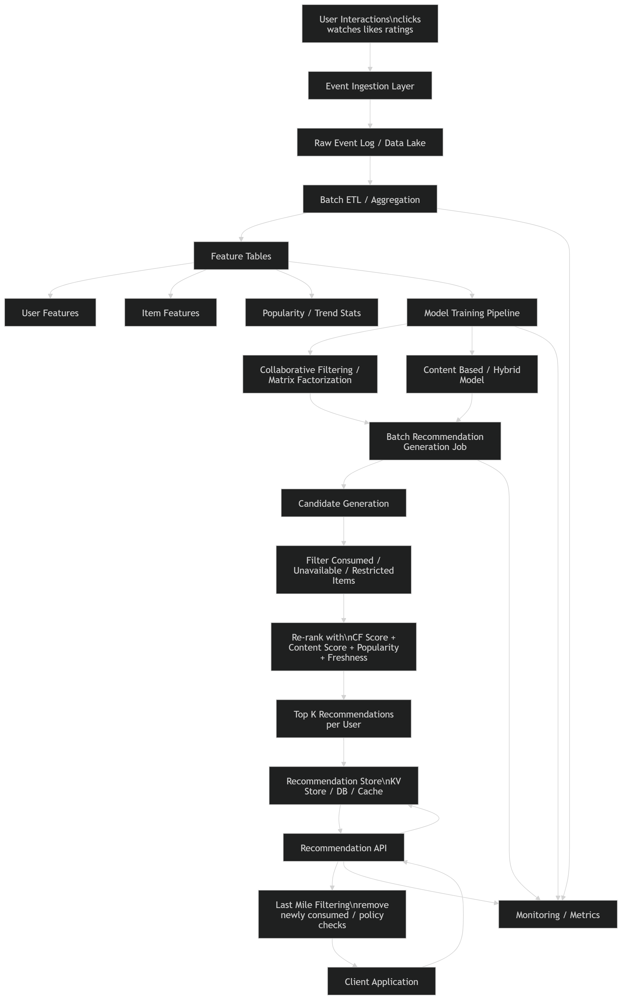

# Offline Recommendation System Design

## 1. Problem Statement

Design an **offline recommendation system** for a content platform that periodically generates personalized recommendations for users based on historical interactions.

The system should:

* process user-item interaction history in batch
* generate top-N recommendations per user
* store them for low-latency serving
* refresh recommendations periodically

This is suitable for:

* homepage recommendation rows
* daily recommendations
* “because you watched”
* email/push recommendation campaigns

---

# 2. Functional Requirements

## 2.1 Core Functional Requirements

1. The system shall ingest:

   * user interaction history
   * item metadata
   * optional explicit feedback (ratings)

2. The system shall generate personalized top-K recommendations for each active user.

3. The system shall support offline batch recomputation:

   * daily
   * hourly
   * or custom cadence

4. The system shall exclude:

   * already consumed items
   * unavailable items
   * blocked / region-restricted items

5. The system shall store recommendations in a fast lookup store for serving.

6. The system shall expose an API to fetch precomputed recommendations for a user.

7. The system shall support multiple recommendation types:

   * homepage recommendations
   * similar items
   * trending fallback
   * new-user fallback

8. The system shall support model retraining and recommendation regeneration independently.

---

## 2.2 Optional Functional Requirements

1. Support multiple algorithms:

   * collaborative filtering
   * content-based
   * hybrid

2. Support recommendation explanations:

   * “because you watched X”
   * “popular in your category”

3. Support A/B testing of recommendation strategies.

4. Support business filters:

   * region
   * age restriction
   * premium/free content

---

# 3. Non-Functional Requirements

## 3.1 Performance

* Recommendation fetch latency should be low, ideally under **50 ms**
* Batch generation can be slow relative to online systems, but should finish within the batch window

## 3.2 Scalability

* Must handle millions of users and items
* Must scale batch processing horizontally

## 3.3 Availability

* Recommendation serving API should be highly available
* If personalized recommendations are unavailable, system should fall back to cached/popular results

## 3.4 Freshness

* Recommendations are not strictly real-time
* Refresh interval can be daily or hourly depending on business needs

## 3.5 Reliability

* Batch failures should not wipe existing recommendations
* Use last successful snapshot as fallback

## 3.6 Maintainability

* Clear separation of:

  * data ingestion
  * feature generation
  * model training
  * recommendation generation
  * serving

## 3.7 Observability

* Track:

  * batch completion time
  * model metrics
  * recommendation coverage
  * CTR / watch rate after deployment

---

# 4. Back-of-the-Envelope Estimation

Let’s assume a medium-large platform.

## 4.1 Assumptions

* Total users = **10 million**
* Daily active users = **2 million**
* Total items = **1 million**
* Average interactions per active user per day = **20**
* Recommendations stored per active user = **100**
* Batch refresh = **once per day**

---

## 4.2 Interaction Volume

Daily interactions:

[
2M \times 20 = 40M \text{ interactions/day}
]

If each interaction record is ~100 bytes:

[
40M \times 100 = 4GB/day
]

Raw interaction ingestion is manageable.

---

## 4.3 Recommendation Storage

Store top 100 recommendations for 10M users.

Total recommendation entries:

[
10M \times 100 = 1B \text{ entries}
]

Assume each entry stores:

* item_id = 8 bytes
* score = 4 bytes
* rank = 4 bytes
* some metadata overhead

Say ~24 bytes per recommendation entry.

[
1B \times 24 = 24GB
]

With indexing + storage overhead, plan for around **40–60 GB**.

This is very feasible in distributed KV storage / cache / document DB.

---

## 4.4 Batch Compute

If each active user needs candidate scoring over 10,000 items, naive compute becomes too expensive:

[
2M \times 10K = 20B \text{ scoring ops}
]

So we need:

* candidate pruning
* precomputed neighbors
* approximate or heuristic filtering
* distributed batch jobs

---

## 4.5 Serving QPS

Suppose DAU = 2M and each user requests recommendations 5 times/day:

[
2M \times 5 = 10M \text{ recommendation requests/day}
]

Average QPS:

[
10M / 86400 \approx 116 QPS
]

Peak may be 10x:

~**1K–2K QPS**

That is easy for a replicated serving tier with cache.

---

# 5. High-Level Design



## 5.1 Core Components

1. **Event Ingestion Layer**

   * collects user interactions
   * watches, clicks, likes, ratings

2. **Raw Data Store / Data Lake**

   * stores immutable logs

3. **Batch Processing Pipeline**

   * aggregates interactions
   * builds user-item matrices / features

4. **Feature Store / Preprocessed Tables**

   * user features
   * item features
   * popularity stats
   * interaction summaries

5. **Model Training Pipeline**

   * trains collaborative filtering / hybrid model

6. **Recommendation Generation Job**

   * computes top-K recommendations per user

7. **Recommendation Store**

   * stores final precomputed recommendation lists

8. **Serving API**

   * fetches recommendations for user
   * applies final lightweight filtering

9. **Monitoring + Experimentation**

   * metrics
   * model versioning
   * A/B testing

---

## 5.2 High-Level Flow

```text
User Events
   ↓
Event Log / Data Lake
   ↓
Batch ETL / Aggregation
   ↓
Feature Tables
   ↓
Model Training
   ↓
Batch Recommendation Generation
   ↓
Recommendation Store
   ↓
Recommendation API
   ↓
Client Application
```

---

## 5.3 API Shape

Example:

### GET /recommendations?user_id=U123&type=homepage

Response:

```json
{
  "user_id": "U123",
  "type": "homepage",
  "generated_at": "2026-03-23T02:00:00Z",
  "items": [
    {"item_id": "I901", "score": 0.92},
    {"item_id": "I117", "score": 0.89}
  ]
}
```

---

# 6. Data Model

## 6.1 User Interaction Table

* user_id
* item_id
* event_type
* timestamp
* watch_time
* rating
* device
* region

## 6.2 Item Metadata Table

* item_id
* category
* tags
* language
* release_date
* availability_status

## 6.3 User Feature Table

* user_id
* top_categories
* avg_session_length
* recent_activity_count
* embedding / latent factors

## 6.4 Recommendation Table

* user_id
* recommendation_type
* item_id
* score
* rank
* generated_at
* model_version

---

# 7. Low-Level Design: Recommendation Algorithm

I’ll design a practical **hybrid offline recommender**:

* collaborative filtering for behavior patterns
* content-based fallback for sparse users/items
* popularity fallback for cold start

This is more realistic than pure CF.

---

## 7.1 Candidate Sources

For each user, generate candidates from:

1. **Collaborative Filtering candidates**

   * similar users liked these items
   * or matrix factorization top items

2. **Content-based candidates**

   * similar to items user consumed

3. **Popular / trending candidates**

   * fallback for sparse users

4. **Business-priority candidates**

   * optional promoted content

Union all candidate sets, then rank.

---

## 7.2 Core Algorithm Option A: Matrix Factorization

We have sparse matrix (R):

[
R_{u,i} = \text{interaction strength}
]

We learn:

[
R \approx U \cdot V^T
]

Where:

* (U_u) = user latent vector
* (V_i) = item latent vector

Predicted preference:

[
\hat{r}_{u,i} = U_u^T V_i
]

Interaction strength can be weighted:

* watch = 1
* like = 2
* rating = explicit score
* long watch time = boosted score

---

## 7.3 Batch Training Steps

### Step 1: Build interaction matrix

From logs, convert events into weighted interactions.

Example:

* click = 1
* partial watch = 2
* full watch = 4
* like = 5

### Step 2: Train latent factor model

Use ALS / SGD / implicit matrix factorization.

### Step 3: Compute user and item embeddings

Persist learned vectors.

### Step 4: Generate top candidates

For each active user:

* score items using dot product
* exclude consumed items
* select top-K

---

## 7.4 Candidate Filtering

Before final ranking, remove:

* consumed items
* unavailable items
* low-quality items
* blocked categories
* region-incompatible items

---

## 7.5 Re-ranking Logic

Final score can be hybrid:

[
FinalScore = w_1 \cdot CFScore + w_2 \cdot ContentScore + w_3 \cdot PopularityScore + w_4 \cdot FreshnessScore
]

Where:

* **CFScore** = latent similarity
* **ContentScore** = metadata/content similarity
* **PopularityScore** = global or regional popularity
* **FreshnessScore** = boost for newer items

Then sort descending and keep top-N.

---

## 7.6 Cold Start Strategy

### New User

No history:

* use region popularity
* category popularity
* onboarding preferences if available

### New Item

No interaction history:

* use content similarity
* inject item into eligible candidate pools
* optionally boost exploration offline

---

## 7.7 Similar Item Recommendations

For “Because you watched X”:

* precompute item-item similarity matrix
* use:

  * content similarity
  * item embedding cosine similarity
  * co-watch/co-click stats

Store top-M neighbors per item.

---

## 7.8 Output Generation

For each user, generate:

* top 100 homepage recommendations
* top 50 category-based recommendations
* top similar items per item

Store with:

* rank
* score
* model version
* timestamp

---

# 8. Serving Design

Since this is offline, serving is simple.

## 8.1 Read Path

```text
Client → API Gateway → Recommendation Service → Recommendation Store
```

The recommendation service:

1. fetches precomputed list
2. applies last-mile filters
3. returns top-K

---

## 8.2 Last-Mile Filtering

At request time:

* remove newly consumed items
* respect parental / region restrictions
* optionally shuffle slightly within top band

This gives some freshness without heavy online inference.

---

# 9. Scaling Strategy

## 9.1 Batch Pipeline Scaling

Use distributed compute:

* Spark
* Flink batch mode
* distributed SQL engines
* MapReduce-style processing

Partition by:

* user_id
* item_id
* time window

---

## 9.2 Model Training Scaling

For large matrices:

* use distributed ALS
* partition embeddings
* train incrementally if possible

If full retraining is too expensive:

* retrain model daily
* recompute recommendations in smaller hourly deltas for active users

---

## 9.3 Recommendation Generation Scaling

Top-K generation is expensive.

Optimizations:

* only generate for active users
* restrict candidates by category/language/region
* precompute item neighborhoods
* use approximate retrieval on embeddings if matrix factorization candidate space is huge

---

## 9.4 Serving Scaling

Recommendation store can be:

* Redis for very hot reads
* Cassandra / DynamoDB / Bigtable / key-value DB for durable scalable lookup
* document store if recommendation payloads are grouped per user

Best pattern:

* key = user_id + recommendation_type
* value = ordered list of item IDs + scores

---

## 9.5 Caching

Use:

* API cache for hot users
* CDN if recommendation payloads are semi-static
* in-memory cache in recommendation service

---

# 10. Tradeoffs

## 10.1 Offline vs Online

### Offline advantages

* simpler
* cheaper
* predictable latency
* easier debugging

### Offline disadvantages

* stale recommendations
* poor session adaptation
* delayed reaction to new content or behavior

---

## 10.2 Collaborative Filtering vs Content-Based

### CF

Pros:

* captures hidden taste patterns
* strong personalization

Cons:

* sparsity
* cold start
* expensive at scale

### Content-based

Pros:

* good for new items
* explainable

Cons:

* overspecialization
* limited discovery

So hybrid usually wins.

---

## 10.3 Full Recompute vs Incremental Refresh

### Full recompute

Pros:

* clean consistency
* easier reasoning

Cons:

* expensive
* slow

### Incremental refresh

Pros:

* fresher results
* cheaper for subsets

Cons:

* more complex
* consistency issues

---

## 10.4 Store Top-K Only vs Large Candidate List

### Store only final top-K

Pros:

* compact
* fast serving

Cons:

* little flexibility at request time

### Store larger list

Pros:

* more room for filtering/shuffling
* better last-mile handling

Cons:

* more storage

Usually store **top 100–500**, serve **top 10–20**.

---

# 11. Failure Handling

## 11.1 Batch Failure

* keep last successful recommendation snapshot
* do not overwrite with partial results

## 11.2 Data Delay

* use previous day model/results
* degrade gracefully to popularity lists

## 11.3 Corrupt Model

* version model artifacts
* rollback quickly

---

# 12. Monitoring and Metrics

## 12.1 System Metrics

* batch job duration
* failed jobs
* API latency
* cache hit rate
* recommendation store read latency

## 12.2 Model / Product Metrics

* CTR
* watch time
* completion rate
* save/add-to-list rate
* diversity
* coverage
* novelty

## 12.3 Quality Monitoring

* percentage of users receiving full top-N
* fraction of repeated items
* cold-start user coverage
* distribution skew toward popular items

---

# 13. Final Design Summary

This offline recommendation system works as follows:

1. Collect historical user-item interactions
2. Run batch ETL to build feature tables
3. Train collaborative filtering / hybrid model
4. Generate top-N recommendations per active user
5. Store results in a scalable key-value store
6. Serve recommendations via low-latency API
7. Refresh periodically and fall back to previous snapshots on failure

This design is strong when:

* personalization can tolerate some staleness
* scale is large
* cost and operational simplicity matter

This design is weak when:

* session intent changes fast
* recommendations must react instantly
* new items must be promoted immediately
