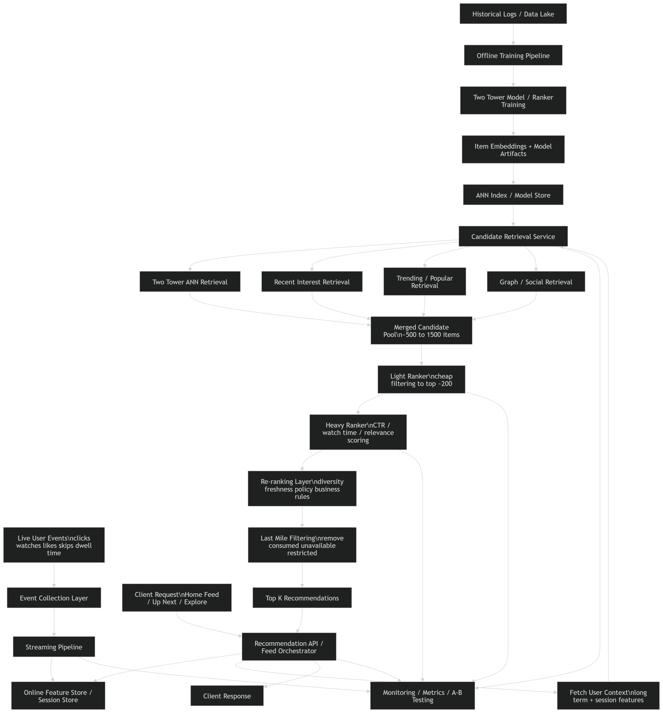

# Online Recommendation System Design

## 1. Problem Statement

Design an **online recommendation system** for a content platform that generates personalized recommendations in near real time based on:

* long-term user history
* recent interactions
* current session behavior
* latest item availability and freshness

The system should:

* serve recommendations with low latency
* adapt quickly to new user actions
* support large-scale candidate retrieval and ranking
* degrade gracefully under failure

This is suitable for:

* social media feeds
* reels / short video recommendation
* “up next” suggestions
* session-aware homepage recommendations

---

# 2. Functional Requirements

## 2.1 Core Functional Requirements

1. The system shall ingest real-time user events:

   * clicks
   * watches
   * likes
   * skips
   * dwell time
   * search actions

2. The system shall generate personalized recommendations for a user at request time.

3. The system shall reflect recent user behavior with low delay.

4. The system shall retrieve candidate items from a large catalog efficiently.

5. The system shall rank candidates using user, item, and context features.

6. The system shall exclude:

   * consumed items
   * unavailable items
   * blocked items
   * policy-restricted items

7. The system shall support fallback recommendations:

   * trending
   * popular
   * category-based
   * cached previous results

8. The system shall support multiple recommendation surfaces:

   * home feed
   * up next
   * similar items
   * explore tab

---

## 2.2 Optional Functional Requirements

1. Support exploration strategies:

   * freshness injection
   * diversity
   * bandit-based exploration

2. Support session-aware ranking.

3. Support re-ranking based on business constraints:

   * monetization
   * fairness
   * creator exposure
   * ad spacing

4. Support experimentation and A/B testing.

---

# 3. Non-Functional Requirements

## 3.1 Latency

This is the dominant requirement.

* P99 latency ideally under **200 ms**
* Retrieval should be fast
* Ranking must fit strict latency budget

---

## 3.2 Scalability

* Must handle millions of users and items
* Must support high QPS
* Must scale both serving and feature infrastructure

---

## 3.3 Availability

* Recommendation API should be highly available
* if online components fail, serve fallback/cached results

---

## 3.4 Freshness

* user actions should affect recommendations quickly
* newly uploaded items should become eligible quickly

---

## 3.5 Consistency

* perfect consistency is not required
* eventual consistency is acceptable for features/events

---

## 3.6 Reliability

* failures in retrieval/ranking should not break the whole feed
* stale fallback is better than empty response

---

## 3.7 Observability

Track:

* latency by stage
* feature freshness
* ANN retrieval quality
* ranking metrics
* CTR / watch time / retention

---

# 4. Back-of-the-Envelope Estimation

Let’s assume a reasonably large platform.

## 4.1 Assumptions

* total users = **50 million**
* daily active users = **10 million**
* peak concurrent users = **1 million**
* total items = **10 million**
* average recommendation requests per DAU per day = **20**
* peak QPS = around **20K**
* top candidates retrieved per request = **1000**
* final items shown = **20**

---

## 4.2 Request Volume

Daily recommendation requests:

[
10M \times 20 = 200M \text{ requests/day}
]

Average QPS:

[
200M / 86400 \approx 2315 \text{ QPS}
]

Peak traffic can easily be 5–10x:

[
\text{Peak QPS} \approx 10K - 25K
]

So the serving stack must comfortably handle **tens of thousands of QPS**.

---

## 4.3 Event Volume

Suppose each active user generates 50 events/day:

[
10M \times 50 = 500M \text{ events/day}
]

If each event is ~200 bytes:

[
500M \times 200 = 100GB/day
]

This is manageable with Kafka / PubSub / Kinesis-scale streaming.

---

## 4.4 Candidate Scoring Cost

If we scored all 10M items/request, impossible:

[
20K \text{ QPS} \times 10M \text{ items}
]

So we must do:

* candidate retrieval
* ANN
* multi-stage ranking

If retrieval reduces to 1000 candidates:

[
20K \times 1000 = 20M \text{ candidate scores/sec}
]

Still large, but feasible with distributed rankers.

---

## 4.5 Memory for Item Embeddings

Suppose:

* 10M items
* embedding dimension = 128
* float32 = 4 bytes

[
10M \times 128 \times 4 = 5.12GB
]

Very manageable for in-memory ANN shards. With index overhead, maybe **10–20 GB+** depending on structure.

---

# 5. High-Level Design



## 5.1 Core Components

1. **Event Collection Layer**

   * collects user interactions in real time

2. **Streaming Pipeline**

   * updates user/session features
   * writes to feature store

3. **Online Feature Store / Session Store**

   * latest user behavior
   * counters
   * session context
   * recent history

4. **Candidate Retrieval Service**

   * ANN / two-tower retrieval
   * popular / trending / graph-based retrieval
   * follows / subscriptions retrieval

5. **Ranking Service**

   * scores retrieved candidates using richer features

6. **Re-ranking / Policy Layer**

   * diversity
   * freshness
   * policy constraints
   * business rules

7. **Recommendation API / Feed Service**

   * orchestrates full pipeline
   * returns final ranked items

8. **Offline Training Pipeline**

   * trains towers/rankers periodically
   * updates embeddings/models

9. **Model Store / Embedding Store**

   * stores current model versions and item embeddings

10. **Monitoring + Experimentation**

* latency
* feature drift
* model metrics
* rollout control

---

## 5.2 High-Level Flow

```text
User Event Stream
    ↓
Streaming Aggregation
    ↓
Online Feature Store / Session Store

User Request
    ↓
Recommendation API
    ↓
Candidate Retrieval Service
    ↓
Ranking Service
    ↓
Re-ranking Layer
    ↓
Response to Client
```

Parallel background flow:

```text
Historical Logs
    ↓
Offline Training
    ↓
New Models / Item Embeddings
    ↓
Model & Index Deployment
```

---

# 6. High-Level Request Path

At request time:

1. User opens app/feed
2. API fetches:

   * recent user history
   * session state
   * context features
3. Retrieval service gets candidate pool
4. Ranking service scores candidates
5. Re-ranker applies constraints
6. API returns top-K

---

# 7. API Shape

### GET /recommendations?user_id=U123&surface=home

Response:

```json
{
  "user_id": "U123",
  "surface": "home",
  "served_at": "2026-03-23T20:00:00Z",
  "items": [
    {"item_id": "I51", "score": 0.97},
    {"item_id": "I78", "score": 0.94}
  ]
}
```

---

# 8. Data Model

## 8.1 Event Log

* user_id
* item_id
* event_type
* timestamp
* dwell_time
* watch_time
* source_surface
* device
* region

## 8.2 User Online Features

* user_id
* recent_item_ids
* recent_categories
* session_embedding
* last_active_time
* recent watch/click counts
* user embedding

## 8.3 Item Features

* item_id
* item embedding
* category
* freshness
* popularity stats
* quality score
* policy flags

## 8.4 Recommendation Request Context

* user_id
* surface
* current time
* app/device info
* session state

---

# 9. Low-Level Design: Recommendation Algorithm

The online system is usually **multi-stage**.

Not:

* score every item

But:

```text
Candidate Retrieval → Light Ranking → Heavy Ranking → Re-ranking
```

---

## 9.1 Stage 1: Candidate Retrieval

Goal:

* quickly reduce item space from millions to ~1000

Candidate sources:

1. **Two-Tower ANN retrieval**

   * user embedding vs item embeddings

2. **Recent-interest retrieval**

   * similar to items recently consumed

3. **Trending/popular retrieval**

   * fallback and exploration

4. **Graph/social retrieval**

   * follows, subscriptions, creator affinity

5. **Business candidate injection**

   * optionally promoted/exploration candidates

Union these pools and deduplicate.

### Example output:

* 300 ANN candidates
* 200 recent-interest candidates
* 200 trending candidates
* 300 graph/social candidates

Final deduped set ≈ 500–1500 candidates

---

## 9.2 User Embedding Computation

At request time, compute user representation using:

* long-term embedding from offline model
* short-term session embedding from recent actions

One practical formula:

[
u_{final} = \alpha \cdot u_{long} + (1-\alpha) \cdot u_{session}
]

This helps mix:

* stable preferences
* current intent

---

## 9.3 ANN Retrieval

Use:

* FAISS / ScaNN / HNSW-like index

Item embeddings are precomputed offline and loaded into ANN shards.

At request time:

* fetch current user embedding
* query ANN index
* retrieve top-K similar items

---

## 9.4 Stage 2: Light Ranker

Goal:

* cheaply reduce candidates from ~1000 to ~200

Model:

* logistic regression
* shallow MLP
* GBDT

Features:

* user-item embedding similarity
* item popularity
* freshness
* basic user-category match
* recent session match

Why:

* fast enough for real-time
* avoids sending too many items to expensive ranker

---

## 9.5 Stage 3: Heavy Ranker

Goal:

* precisely score top ~200 candidates

Model:

* deep ranking model
* DLRM-style model
* pairwise/listwise fine-tuned ranker

Features:

* user long-term features
* user session features
* item metadata
* cross features
* interaction history statistics
* contextual signals

Output:

* relevance score
* CTR estimate
* watch-time estimate
* completion probability

Sometimes final score is weighted:

[
FinalScore = w_1 \cdot CTR + w_2 \cdot WatchTime + w_3 \cdot Quality + w_4 \cdot Freshness
]

---

## 9.6 Stage 4: Re-ranking

The raw top-K from heavy ranker is usually not directly shown.

Re-ranking adjusts for:

* diversity
* freshness
* repeated content suppression
* creator balancing
* policy/business rules

Examples:

* avoid 10 nearly identical videos in a row
* boost fresh content
* limit same creator repetition

---

## 9.7 Filtering Rules

At request time, remove:

* already consumed items
* muted creators
* blocked categories
* region/age restricted items
* out-of-stock/unavailable content

---

## 9.8 Exploration Layer

Pure exploitation is dangerous.

So inject small exploration quota:

* some fresh items
* some uncertain but promising items
* some popularity-based candidates

Can be:

* heuristic
* bandit-based

---

# 10. Feature Infrastructure

This is one of the hardest parts.

## 10.1 Offline Features

Computed in batch:

* long-term user embedding
* item embedding
* historical engagement stats
* category affinity

## 10.2 Online Features

Computed/updated in stream:

* recent clicks
* recent watches
* session embedding
* short-term frequency
* current popularity

## 10.3 Feature Store Need

We need a low-latency store to fetch:

* fresh user features
* session features
* item stats

Without this, online recommendation collapses.

---

# 11. Model Update Strategy

## 11.1 Offline Model Training

Periodic:

* retrain two-tower
* retrain rankers
* refresh item embeddings

Cadence:

* daily or every few hours

## 11.2 Online Adaptation

Near-real-time:

* session feature updates
* popularity counters
* short-term affinity adjustments

We usually do **not** fully retrain big models online.
We combine:

* offline-trained models
* online-updated features

---

# 12. Serving Architecture

## 12.1 Orchestrator Pattern

Recommendation API acts as orchestrator:

* fetch features
* call retrieval service
* call ranker
* apply re-ranking
* return results

### Flow:

```text
Client
  ↓
API Gateway
  ↓
Recommendation Service
  ├── Feature Store
  ├── Retrieval Service
  ├── Ranking Service
  └── Re-ranker / Policy Layer
```

---

## 12.2 Caching

Useful caches:

* item features cache
* popular candidates cache
* user recent recommendations cache
* ANN query cache for repeated users

But cache must be used carefully because freshness matters.

---

# 13. Scaling Strategy

## 13.1 Horizontal Scaling

Independent scaling for:

* recommendation API
* retrieval service
* ranker service
* feature store
* stream processors

---

## 13.2 ANN Index Sharding

For huge item catalogs:

* shard by item ID range
* or semantic partition
* gather top results across shards

---

## 13.3 Ranking Cost Control

Heavy ranking is expensive.

So:

* reduce candidate count aggressively
* use light ranker first
* use batching on inference servers
* use GPU/CPU pools depending on model size

---

## 13.4 Feature Store Scaling

This is critical at high QPS.

Need:

* hot user/session feature access
* replication
* low-latency reads
* eventual consistency acceptable

---

## 13.5 Event Pipeline Scaling

Use partitioned stream processing keyed by:

* user_id
* item_id
* region

This ensures stateful feature updates scale horizontally.

---

# 14. Tradeoffs

## 14.1 Online vs Offline

### Online advantages

* reacts to latest behavior
* supports session intent
* fresher recommendations

### Online disadvantages

* more infra complexity
* higher latency pressure
* expensive serving

---

## 14.2 Two-Tower Retrieval vs Rich Cross Model

### Two-tower

Pros:

* fast retrieval
* ANN-friendly

Cons:

* simple interaction modeling

### Rich cross model

Pros:

* more accurate ranking

Cons:

* too expensive over huge catalog

Hence:

* two-tower for retrieval
* richer model for ranking

---

## 14.3 Freshness vs Stability

If system updates too aggressively:

* feed becomes noisy

If too slowly:

* feed feels stale

So online systems often combine:

* stable long-term preference
* lightweight session adjustments

---

## 14.4 Exploration vs Exploitation

Too much exploitation:

* filter bubble
* no discovery

Too much exploration:

* lower short-term CTR

Need a controlled balance.

---

## 14.5 Model Complexity vs Latency

More complex models:

* better ranking quality
* worse latency and infra cost

Real systems almost always use:

* simple retrieval
* staged ranking
* minimal heavy inference budget

---

# 15. Failure Handling

## 15.1 Retrieval Failure

Fallback to:

* cached recommendations
* trending items
* category popularity

## 15.2 Feature Store Failure

Fallback to:

* long-term offline user embedding
* generic user segment defaults

## 15.3 Ranker Failure

Fallback to:

* retrieval order
* light ranker output
* precomputed safe list

## 15.4 Event Delay

If stream is delayed:

* serve slightly stale session features
* keep system available

---

# 16. Monitoring and Metrics

## 16.1 System Metrics

* P50/P95/P99 latency
* retrieval latency
* ranking latency
* feature fetch latency
* ANN recall proxy
* error rates
* cache hit rate

## 16.2 Product Metrics

* CTR
* watch time
* completion rate
* session length
* retention
* diversity
* novelty

## 16.3 Model Metrics

* ranking quality
* calibration
* feature drift
* embedding drift
* candidate coverage

---

# 17. Final Design Summary

This online recommendation system works as follows:

1. User behavior is streamed in real time
2. Online/session features are updated continuously
3. At request time, retrieval service pulls candidates from a huge catalog using two-tower embeddings and ANN
4. Light and heavy rankers refine the candidate set
5. Re-ranking enforces diversity, freshness, and policy constraints
6. The system returns a fresh personalized list under strict latency limits
7. If any component fails, it falls back gracefully to cached or popular results

This design is strong when:

* session intent matters
* freshness matters
* engagement optimization is critical

This design is weak when:

* infra budget is tight
* operational complexity must stay low
* staleness is acceptable
